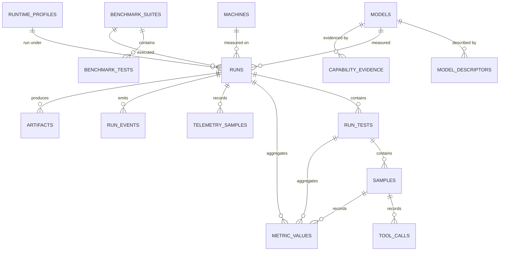
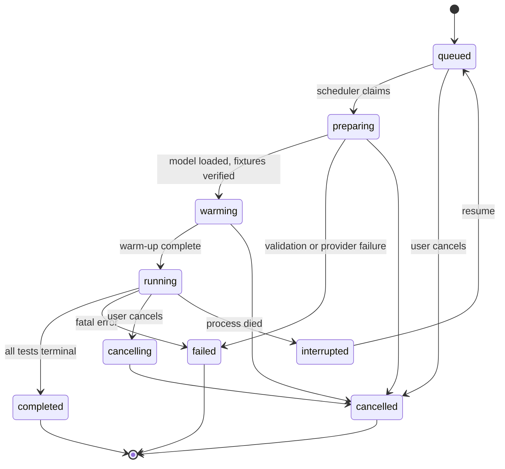

# FreeWeight — Data Model

**Database:** `freeweight.sqlite3` (or a PostgreSQL database), owned exclusively by FreeWeight.
**Corrected 2026-08-21** by the [final architecture audit](../../reviews/final_architecture_audit.md):
ADR-0022 (evidence contract), ADR-0027 (telemetry split, target GPU), ADR-0028 (prompt subset hash).
**Conventions:** [Database Standards](../../standards/database-standards.md) — ULID primary keys,
`snake_case`, units in names, timezone-aware UTC timestamps, enforced foreign keys, `NULL` + reason
for unavailable measurements.

---

## 1. Entity overview



---

## 2. Tables

### `machines`
Static machine identity. One row per fingerprint.

```text
id ULID PK · machine_fingerprint TEXT UNIQUE NOT NULL · hostname · os_name · os_version · kernel
architecture · cpu_model · physical_cores · logical_cores · ram_bytes
gpus_json · storage_json · python_version · first_seen_at · last_seen_at
```
Index: `machine_fingerprint` (unique).

### `models`
Canonical model identity ([Canonical Model Identity §6](../../architecture/canonical-model-identity.md)).

```text
id ULID PK · provider_kind TEXT NOT NULL · provider_model_name TEXT NOT NULL
artifact_digest TEXT NULL · canonical_id TEXT NOT NULL · identity_confidence TEXT NOT NULL
first_seen_at · last_seen_at · aliases_json          -- observed alias → resolution history
UNIQUE (provider_kind, provider_model_name, artifact_digest)
```
Indexes: `canonical_id`, `(provider_kind, provider_model_name)`.
Repository rule: at most one `name_only` row per `(provider_kind, provider_model_name)`; a later
digest **upgrades** that row rather than creating a duplicate.

### `model_descriptors`
Point-in-time descriptive metadata. A run references the snapshot it was produced with, so history
never changes when a descriptor is refreshed.

```text
id ULID PK · model_id FK→models ON DELETE RESTRICT · observed_at
family · architecture · parameter_count · active_parameter_count · expert_count
quantization · weight_format · size_bytes · max_context · embedding_dim · layers
attention_heads · kv_heads · head_dim · vocab_size · rope_config_json · sliding_window
declared_capabilities_json · license_text · raw_json · descriptor_hash
```
Index: `(model_id, observed_at DESC)`, `descriptor_hash`.

### `runtime_profiles`
```text
id ULID PK · profile_hash TEXT UNIQUE NOT NULL · context_size · kv_cache_precision
gpu_layers · flash_attention · threads · batch_size · keep_alive · provider_options_json
created_at
```

### `benchmark_suites`
```text
id ULID PK · key TEXT NOT NULL · name · version TEXT NOT NULL · category
runner TEXT NOT NULL              -- native | external
manifest_hash TEXT NOT NULL · manifest_json · dataset_hashes_json
prompt_subset_hash TEXT NULL · prompt_refs_json   -- the prompts THIS suite declares, and their hash;
                                                  -- this, not the pack hash, is the fingerprint input
source_json · license · installed_at
UNIQUE (key, version)
```

### `benchmark_tests`
```text
id ULID PK · suite_id FK→benchmark_suites ON DELETE CASCADE · key · name · category
scorer TEXT NOT NULL · config_json · metric_definitions_json · requires_json
UNIQUE (suite_id, key)
```

### `runs`
```text
id ULID PK · machine_id FK · model_id FK · model_descriptor_id FK · runtime_profile_id FK
suite_id FK · status TEXT NOT NULL                 -- see §3
created_at · started_at · completed_at
effective_config_json                              -- resolved execution parameters
reproducibility_fingerprint TEXT NOT NULL · fingerprint_document_json
provider_kind · provider_version · application_version · git_commit
prompt_pack_id · prompt_pack_version · prompt_pack_hash   -- provenance only, NOT fingerprint inputs
served_context INT NULL · served_context_source TEXT NULL  -- configured | reported | assumed
gpu_index INT NULL · multi_gpu_visible BOOLEAN NOT NULL DEFAULT FALSE
sandbox_tier TEXT NULL · telemetry_overhead_percent NUMERIC NULL
degradations_json · error_code · error_text
label TEXT NULL · notes TEXT NULL
```
Indexes: `(status, created_at DESC)`, `(model_id, created_at DESC)`,
`(machine_id, created_at DESC)`, `reproducibility_fingerprint`, `(suite_id, created_at DESC)`.

### `run_tests`
```text
id ULID PK · run_id FK ON DELETE CASCADE · test_id FK ON DELETE RESTRICT
status TEXT NOT NULL · skip_reason TEXT NULL       -- unsupported_capability | sandbox_unavailable |
                                                   -- dataset_missing | insufficient_vram | user_excluded
completed_cases · total_cases · repetitions
started_at · completed_at · measurement_class TEXT  -- cold | warm | cache_reused | n/a
error_code · error_text
```
Index: `(run_id, status)`.

### `samples`
The raw record. Every headline number drills to rows here.

```text
id ULID PK · run_test_id FK ON DELETE CASCADE
case_id TEXT NOT NULL · ordinal INT NOT NULL · repetition INT NOT NULL
status TEXT NOT NULL                               -- completed | failed | timeout | cancelled | skipped
prompt_hash · rendered_prompt_hash · prompt_id · prompt_version
response_hash · response_text TEXT NULL            -- only when the run requested content storage
input_tokens · output_tokens · thinking_tokens · tool_tokens
output_chars · output_words · output_bytes
client_wall_ms · client_ttft_ms
backend_load_ms · backend_prompt_eval_ms · backend_decode_ms · backend_total_ms
finish_reason · score NUMERIC NULL · score_method TEXT   -- execution|rule|reference|human|judge
judge_model_id FK NULL · result_json · error_code · error_text · created_at
UNIQUE (run_test_id, case_id, ordinal, repetition)
```
Indexes: `(run_test_id, ordinal)`, `(run_test_id, status)`, `created_at`.
Rule: a `failed`/`timeout`/`skipped` sample has `score = NULL`, never `0`, and is excluded from
aggregates while remaining visible in counts.

### `metric_values`
Metrics at three levels: run, run_test and sample.

```text
id ULID PK · run_id FK ON DELETE CASCADE · run_test_id FK NULL · sample_id FK NULL
metric_key TEXT NOT NULL · numeric_value NUMERIC NULL · text_value TEXT NULL
unavailable_reason TEXT NULL                      -- non-NULL ⇒ this metric is "unsupported"
gpu_index INT NULL                                -- required for any VRAM, power, energy or
                                                  -- temperature metric; NULL for device-independent
                                                  -- metrics. There is no machine-wide GPU figure.
unit TEXT NOT NULL · aggregation TEXT NOT NULL     -- mean|median|p50|p95|p99|min|max|sum|count|ratio|raw
higher_is_better BOOLEAN NOT NULL
sample_count INT NULL · excluded_count INT NULL · stddev NUMERIC NULL
coefficient_of_variation NUMERIC NULL · created_at
```
Indexes: `(run_id, metric_key)`, `(run_test_id, metric_key)`, `(metric_key, numeric_value)`.

### `tool_calls`
```text
id ULID PK · sample_id FK ON DELETE CASCADE · turn_index · call_index
tool_name · arguments_json · schema_valid BOOLEAN · expected_tool TEXT NULL
correct_tool BOOLEAN NULL · correct_arguments BOOLEAN NULL
status TEXT · latency_ms · result_hash · created_at
```

### `telemetry_samples`
Persisted **only** during a run. **One row per sample**, holding the host fields.

```text
id ULID PK · run_id FK ON DELETE CASCADE · timestamp
cpu_percent · load_average_1m · ram_used_bytes · ram_available_bytes · ram_total_bytes
cpu_temperature_c · disk_read_bytes_per_sec · disk_write_bytes_per_sec · process_rss_bytes
```
Index: `(run_id, timestamp)`.

### `telemetry_gpu_samples`
Zero or more rows per sample, one per visible GPU. A machine with no GPU produces host rows and no GPU
rows, which removes the "one row per sample with `gpu_index NULL`" special case.

```text
id ULID PK · telemetry_sample_id FK→telemetry_samples ON DELETE CASCADE
run_id FK ON DELETE CASCADE                      -- denormalized for the chart query
gpu_index INT NOT NULL · gpu_uuid
gpu_utilization_percent · gpu_memory_utilization_percent
vram_used_bytes · vram_total_bytes
gpu_temperature_c · gpu_memory_temperature_c · gpu_power_watts · gpu_power_limit_watts
gpu_fan_percent · gpu_core_clock_mhz · gpu_memory_clock_mhz
throttle_reasons_json · throttle_reasons_available BOOLEAN
UNIQUE (telemetry_sample_id, gpu_index)
```
Index: `(run_id, gpu_index, timestamp)` via the parent's timestamp; `(telemetry_sample_id)`.

The split exists because a single table duplicated every host field across a machine's GPUs, so any
host aggregate double-counted on a two-GPU machine — silently, and only on hardware the reference
machine does not have ([ADR-0027 §4](../../adr/0027-multi-gpu-semantics.md)). Retention policy
configurable; GPU rows cascade with their host row.

### `run_events`
```text
id ULID PK · run_id FK ON DELETE CASCADE · sequence INT NOT NULL
timestamp · event_type TEXT NOT NULL · message TEXT
progress_completed INT NULL · progress_total INT NULL · data_json
UNIQUE (run_id, sequence)
```
Gap-free per run, starting at 1. Source of truth for SSE replay.

### `artifacts`
```text
id ULID PK · run_id FK ON DELETE CASCADE · run_test_id FK NULL · sample_id FK NULL
kind TEXT NOT NULL          -- raw_response | generated_code | external_output | export | log
path TEXT NOT NULL · sha256 TEXT NOT NULL · size_bytes · content_type · created_at
```
Files live under the artifact directory with mode `0600`; deleting a run deletes its artifacts.

### `capability_evidence`
Aggregated, exportable, consumed by LoadCoach.

The field set is normative and matches the consumer's — see
[ADR-0022](../../adr/0022-capability-evidence-record-contract.md).

```text
id ULID PK · model_id FK · runtime_profile_id FK · machine_id FK
capability_id TEXT NOT NULL · score NUMERIC NOT NULL          -- 0..1
confidence NUMERIC NOT NULL · sample_count INT NOT NULL · excluded_count INT NOT NULL
dispersion NUMERIC NULL · source_run_ids_json · contributing_metrics_json
benchmark_versions_json · dataset_hashes_json · prompt_subset_hashes_json
identity_confidence TEXT NOT NULL
environment_snapshot_json                                     -- provider/driver/OS at measurement
measured_at TIMESTAMP NOT NULL   -- the latest completed_at among the contributing runs.
                                 -- This is what freshness decays from. Re-aggregating old runs must
                                 -- not make them look new (ADR-0022 §2), and a test asserts it.
computed_at TIMESTAMP NOT NULL   -- when this aggregation ran. Provenance and the `since` filter
                                 -- for incremental export; never a confidence input.
policy_version TEXT NOT NULL · vocabulary_version TEXT NOT NULL
UNIQUE (model_id, runtime_profile_id, machine_id, capability_id, policy_version)
```
Index: `(capability_id, score DESC)`, `(model_id, capability_id)`.

### `settings`
```text
key TEXT PK · value_json · updated_at
```
Runtime-changeable settings only; never security-relevant ones
([Configuration Standards §7](../../standards/configuration-standards.md)).

### `api_tokens`
```text
id ULID PK · name TEXT NOT NULL · token_sha256 TEXT UNIQUE NOT NULL · scope TEXT NOT NULL
created_at · last_used_at · expires_at NULL · revoked_at NULL
```

---

## 3. Run state machine



Test states: `pending → running → completed | failed | skipped | cancelled`.

Rules: a failed **test** never fails the run; a failed **sample** never fails the test; every
transition is persisted, logged and emitted as an event; `interrupted` is discovered at startup
recovery and is resumable, preserving completed tests.

---

## 4. Retention and deletion

| Data | Default retention | Deletion behaviour |
|---|---|---|
| Runs, tests, samples, metrics | Forever | Deleted only by explicit, previewed, confirmed operations |
| Telemetry samples | Configurable (default: keep) | Deletable independently of the run |
| Run events | Keep with the run | Cascade with the run |
| Artifacts | Keep with the run | Cascade; files removed with the rows in the same transaction boundary |
| Models, machines, descriptors | Forever | **Never** removed by a result deletion; `ON DELETE RESTRICT` enforces it |
| Capability evidence | Recomputed | Recomputation replaces rows for the same policy version; two policy versions coexist, and `measured_at` is carried forward from the contributing runs rather than reset |

Every destructive operation: preview counts → explicit confirmation → transaction → automatic backup
above the configured threshold.

---

## 5. Query-plan requirements

Asserted by tests (`EXPLAIN QUERY PLAN` / `EXPLAIN`):

* Dashboard aggregate over `metric_values` uses `(run_id, metric_key)` — no scan of `samples`.
* Run list uses `(status, created_at DESC)`.
* Sample listing uses `(run_test_id, ordinal)`.
* Telemetry chart uses `(run_id, timestamp)` on the host table and joins GPU rows by
  `telemetry_sample_id`; no query aggregates a host field across GPU rows.
* Event replay uses `(run_id, sequence)`.
* Evidence lookup uses `(capability_id, score DESC)`.
* Model results use `(model_id, created_at DESC)`.
