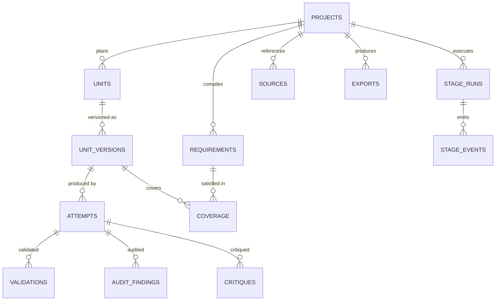
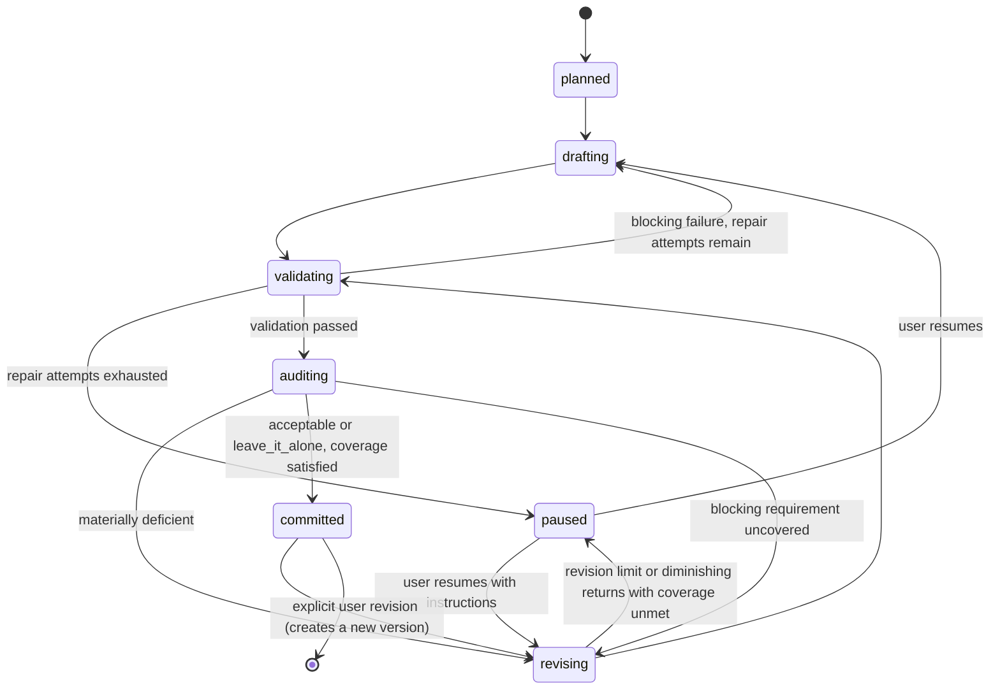

# IdeaPress — Data Model

**Database:** `ideapress.sqlite3` (or PostgreSQL), owned exclusively by IdeaPress.
**Conventions:** [Database Standards](../../standards/database-standards.md).
**Corrected 2026-08-21** by the [final architecture audit](../../reviews/final_architecture_audit.md).

---

## 1. Entity overview



---

## 2. Tables

### `projects`
```text
id ULID PK · title · slug UNIQUE · content_type · content_type_version
workflow_id · workflow_version · status                -- draft|planning|generating|paused|complete|archived
brief_text · author_material_json · config_json        -- per-project overrides of workflow limits and bindings
created_at · updated_at · completed_at NULL · archived_at NULL
```

### `sources`
```text
id ULID PK · project_id FK ON DELETE CASCADE · kind      -- file|note|url(opt-in)
title · path TEXT NULL · sha256 · content_text TEXT NULL · metadata_json · created_at
```

### `requirements`
```text
id ULID PK · project_id FK ON DELETE CASCADE · requirement_key TEXT NOT NULL   -- "R-014"
text · blocking BOOLEAN · checks_json · source_ref
compiled_by_prompt_id · compiled_by_prompt_version · compiled_at
UNIQUE (project_id, requirement_key)
```
Requirements are compiled once and immutable thereafter; recompilation creates a new generation with
`compiled_at` and the old rows retained (a project records which generation it is working against).

### `units`
```text
id ULID PK · project_id FK ON DELETE CASCADE · unit_key TEXT NOT NULL          -- "U-03"
ordinal INT · title · goal_text · requirement_keys_json
state TEXT              -- planned|drafting|validating|auditing|revising|paused|committed
current_version_id FK NULL · paused_reason TEXT NULL · created_at · updated_at
UNIQUE (project_id, unit_key)
```

### `unit_versions`
```text
id ULID PK · unit_id FK ON DELETE CASCADE · version INT NOT NULL
content_text · content_hash · word_count · char_count
committed BOOLEAN · committed_at NULL
created_from_attempt_id FK NULL · created_at
UNIQUE (unit_id, version)
```
Committed versions are immutable. A revision creates version *n+1*.

### `stage_runs`
```text
id ULID PK · project_id FK ON DELETE CASCADE · stage TEXT NOT NULL
state TEXT              -- queued|running|completed|failed|cancelled|interrupted
units_total · units_completed · units_paused
started_at · completed_at · cancelled_at · error_code · error_text
options_json · backend TEXT · backend_mode TEXT
```
One active `stage_runs` row per project is enforced by a partial unique index (or an equivalent
repository check on SQLite).

### `attempts`
The unit of provenance: one bounded model task (or one deterministic stage step).

```text
id ULID PK · stage_run_id FK ON DELETE CASCADE · unit_id FK NULL
stage TEXT · attempt INT · round INT                    -- revision round, 0 for the first pass
backend TEXT · backend_mode TEXT
model_provider_kind · model_provider_name · model_digest NULL · model_canonical_id NULL
prompt_id · prompt_version · prompt_sha256 · rendered_prompt_sha256
prompt_text TEXT NULL · response_text TEXT NULL         -- only when content storage is enabled
response_hash · structured_output_json NULL
input_tokens · output_tokens · thinking_tokens NULL
provider_ms · overhead_ms · ttft_ms
outcome TEXT           -- completed|validation_failed|provider_error|timeout|cancelled|content_rejected
rejection_reason TEXT NULL                              -- the model's own words, when it refused
routing_json NULL                                       -- LoadCoach decision id, score, flags,
                                                        -- runtime_profile_hash, served_context
idempotency_key TEXT NULL                               -- sent to LoadCoach; one per attempt, so a
                                                        -- retried submission replays rather than
                                                        -- creating a second job
degradations_json · error_code · error_text · created_at
UNIQUE (stage_run_id, unit_id, stage, attempt, round)
```

### `validations`
```text
id ULID PK · attempt_id FK ON DELETE CASCADE · check_kind · check_key
passed BOOLEAN · blocking BOOLEAN · detail_json · created_at
```

### `audit_findings`
```text
id ULID PK · attempt_id FK ON DELETE CASCADE · finding_key · category · severity
confidence NUMERIC · problem_text · evidence_text NULL · target_ref NULL
required_fix_text NULL · uncertain BOOLEAN · escalated BOOLEAN · source_stage TEXT · created_at
```

### `critiques`
```text
id ULID PK · attempt_id FK ON DELETE CASCADE
verdict TEXT           -- acceptable|leave_it_alone|materially_deficient
rationale_text · improvement_delta NUMERIC NULL · created_at
```

### `coverage`
```text
id ULID PK · unit_version_id FK ON DELETE CASCADE · requirement_id FK
satisfied BOOLEAN · satisfied_by TEXT      -- deterministic_check|audit|manual
detail_json · evaluated_at
UNIQUE (unit_version_id, requirement_id)
```

### `stage_events`
```text
id ULID PK · stage_run_id FK ON DELETE CASCADE · sequence INT NOT NULL
timestamp · event_type · unit_id NULL · message · data_json
UNIQUE (stage_run_id, sequence)
```

### `exports`
```text
id ULID PK · project_id FK ON DELETE CASCADE · format · path · sha256 · size_bytes
unit_version_ids_json · export_format_version · created_at
```

### `backend_config`, `settings`, `api_tokens`
```text
backend_config: id ULID PK · mode · base_url · model_bindings_json · last_tested_at
                · last_status · capabilities_json · is_remote BOOLEAN
settings:       key TEXT PK · value_json · updated_at
api_tokens:     as in FreeWeight
```

---

## 3. Unit state machine



`paused` is a first-class outcome, not a failure: the unit is intact, its findings are visible, and the
user decides what to do. Nothing is ever committed to escape a loop.

---

## 4. Retention and privacy

| Data | Default | Notes |
|---|---|---|
| Projects, units, versions | Forever | The user's work |
| Attempts | Forever | Provenance; prunable by age on request |
| Prompt/response text | **Not stored** unless `include_content`/per-project storage is enabled | Hashes always stored |
| Stage events | With the stage run | Pruned with the project |
| Exports | On disk in the project directory | Removed with the project on request |
| Audit findings and critiques | With the attempt | — |

Everything stays local. No project content is logged at INFO or above, transmitted anywhere, or
included in an export the user did not request.

---

## 5. Query-plan requirements

Asserted in tests:

* Unit list uses `(project_id, ordinal)`.
* Unit history uses `(unit_id, version DESC)`.
* Attempt lookup uses `(stage_run_id, unit_id, stage)`.
* Coverage report uses `(unit_version_id, requirement_id)`.
* Event replay uses `(stage_run_id, sequence)`.
* Project list uses `(status, updated_at DESC)`.
