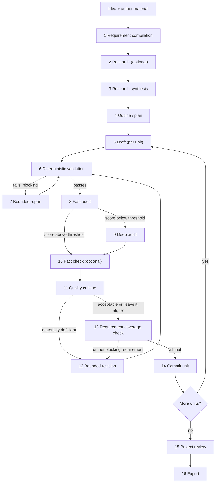

# IdeaPress — Workflows and the Inference Port

**Principle, inherited from the prior project and kept:** *Python owns the control flow; models
perform bounded tasks; the generator never approves its own output.*
**Corrected 2026-08-21** by the [final architecture audit](../../reviews/final_architecture_audit.md):
`fact_check` is a stage rather than a dangling configuration key, and the LoadCoach task map no longer
routes prose audits through a code-review profile.

---

## 1. The pipeline



Two rules make this more than a chain of prompts:

1. **Only Python decides progression.** A gate passes because a deterministic check passed or a
   bounded loop exhausted, never because a model said it was finished.
2. **Auditors report; the writer repairs.** The stage that produced text never grades it. An audit
   produces findings; a repair or revision stage consumes them.

---

## 2. Stages

| # | Stage | Input | Output | Gate | Model? |
|---|---|---|---|---|---|
| 1 | `requirements` | Brief, author material | Identified requirements (blocking/advisory), constraints, prohibitions | Every requirement has an ID and a checkable statement | Yes (bounded, JSON) |
| 2 | `research` | Brief, sources | Source notes with citations | Every note cites an available source | Optional |
| 3 | `research_synthesis` | Notes | Structured synthesis | Structure valid; no uncited claim | Yes |
| 4 | `outline` | Requirements + synthesis | Unit plan (ordered units with goals and requirement IDs) | Every blocking requirement assigned to ≥ 1 unit | Yes |
| 5 | `draft` | Unit spec + bounded context | Unit text | Non-empty; length band; structure | Yes |
| 6 | `validate` | Unit text | Validation report | Deterministic checks pass | **No** |
| 7 | `repair` | Text + validation failures | Revised text | Re-validated | Yes |
| 8 | `audit_fast` | Text + requirements | Findings with severity | Runs to completion | Yes |
| 9 | `audit_deep` | Text + fast findings | Detailed findings | Runs to completion | Yes (escalation only) |
| 10 | `fact_check` | Text + cited sources | Claim-level verdicts with source references | Runs to completion; every unsupported claim becomes a finding | Yes (optional; on for research-backed content types) |
| 11 | `critique` | Text + findings | Quality verdict, possibly "leave it alone" | Runs to completion | Yes |
| 12 | `revise` | Text + findings + verdict | Revised text | Re-validated and re-audited | Yes |
| 13 | `coverage` | Text + requirements | Coverage report | Every blocking requirement satisfied | **No** |
| 14 | `commit` | Validated text | Committed unit + provenance | Atomic write | **No** |
| 15 | `project_review` | All units | Consistency findings | Runs to completion | Yes |
| 16 | `export` | Committed units | Rendered document | Deterministic render | **No** |

Five stages involve no model at all: `validate`, `coverage`, `commit` and `export` — which are the
four that decide whether work proceeds — and `research`, whose "Optional" is the stage itself. No
research backend ships at 1.0 (spec §21 lists them as future extensions), so `research` reaches no
model, has no `[models.stages]` binding, and the eleven bindings in [spec §12](spec.md) are exactly
the model-using stages. The ADR that adds a research backend decides its binding then.

This table is the **only** list of stage identifiers. `[models.stages]` keys, the LoadCoach task map
in §6 and the `stage` values in the API all draw from it, and a startup check asserts the three agree:
a binding for a stage that does not exist, or a model-using stage with no binding, fails validation
naming the stage. `fact_check` was previously bound in configuration and mapped to a task profile
while appearing in no stage list — the check exists so that cannot recur.

---

## 3. Requirement compilation

The mechanism that makes later gates checkable rather than aesthetic.

```json
{
  "requirement_id": "R-014",
  "text": "The section must state that inference runs locally and no content leaves the machine.",
  "blocking": true,
  "unit_ids": ["U-03"],
  "checks": [
    {"kind": "must_contain_any", "values": ["locally", "on-device", "on this machine"]},
    {"kind": "must_not_contain", "values": ["uploads", "sends your data"]}
  ],
  "source": "brief.md#privacy",
  "compiled_by": {"prompt_id": "stages.requirements.compile", "version": "1.0.0"}
}
```

Rules:
* Requirements are compiled **once** and carried unchanged through every stage.
* The compiler may not invent requirements the source material does not support; a test feeds it
  benign material and asserts no requirement is fabricated.
* `blocking` requirements gate the commit. Advisory ones inform critique only.
* Deterministic `checks` are what the coverage gate evaluates; a requirement with no deterministic
  check is evaluated by audit and is flagged as such in the coverage report, so the user can see which
  guarantees are mechanical and which are model-assisted.
* Audit evaluation is an **explicit attestation, never an inference from silence**
  ([ADR-0039](../../adr/0039-audit-gated-blocking-requirements.md)): the audit stages return a
  verdict (`met` / `not_met` / `cannot_judge`) for every check-less requirement, and only a literal
  `met` satisfies one — an absent verdict, `cannot_judge`, or an invented word all leave it
  unsatisfied and pause the unit. `workflow.allow_audit_gated_requirements = false` refuses even
  attestation, for a wholly mechanical gate.

---

## 4. Validation (stage 6) — no model involved

(Stage numbering follows §2; `validate` is stage 6 and is unaffected by the insertion of `fact_check`
at 10.)

| Check | Examples |
|---|---|
| Structural | Heading depth, section presence, list well-formedness, no truncated sentence, no unclosed markup |
| Length | Word/character bands per unit |
| Format | JSON validity and schema for structured units; front-matter validity |
| Content constraints | Required/forbidden phrases; language; banned meta-commentary ("as an AI…") |
| Reference integrity | Every internal reference resolves; every citation exists in the source set |
| Consistency | Names, terms and facts consistent with the project glossary and previously committed units |
| Safety | Model output contains no executable directive that would be rendered unescaped |

Failures are classed `blocking` or `advisory`. Blocking failures route to repair; three failed repair
attempts pause the unit and surface the problem to the user rather than committing something wrong.

---

## 5. Bounded loops

| Loop | Bound | Stop condition |
|---|---|---|
| Repair (after validation failure) | `max_attempts_per_stage` (3) | Validation passes, or the attempt limit, then pause the unit |
| Revision (after critique) | `max_revision_rounds` (3) | "Leave it alone", improvement below `diminishing_returns_threshold`, or the round limit |
| Audit escalation | 1 deep audit per unit per round | Fast-audit score below `audit_escalation_threshold` |

Every loop records why it stopped. **"Leave it alone" is an explicitly valid critique verdict**: a
purely stylistic preference does not trigger a revision, because endless polishing is how these
systems burn hours without improving anything.

Improvement is measured as the change in validation and audit findings between rounds — deterministic
inputs, not the critic's self-assessment.

---

## 6. The inference port

The only place workflow code meets a model.

```python
class InferenceBackend(Protocol):
    """One bounded model task. Workflow code depends on this and nothing else."""

    def health(self) -> BackendHealth: ...
    def list_models(self) -> Sequence[BackendModel]: ...
    def generate(self, request: StageRequest) -> StageResult: ...
    def stream(self, request: StageRequest) -> Iterator[StageEvent]: ...

@dataclass(frozen=True, slots=True)
class StageRequest:
    stage: StageId                      # "draft", "audit_fast", …  — IdeaPress vocabulary only
    system: str                         # rendered from a prompt record
    user: str
    response_format: ResponseFormat | None
    limits: StageLimits                 # max_output_tokens, timeout, temperature
    model_hint: str | None = None       # honoured in standalone; a hint in LoadCoach mode
    correlation: Correlation = …        # project_id, unit_id, attempt

@dataclass(frozen=True, slots=True)
class StageResult:
    text: str
    structured: Any | None
    model: ModelIdentity | None         # None when the backend does not disclose it
    usage: TokenUsage
    timing: Timing
    backend: str
    routing: Mapping[str, Any] | None   # LoadCoach only: decision id, score, flags
    degradations: tuple[str, ...] = ()
```

`StageRequest.stage` uses **IdeaPress's** vocabulary. LoadCoach task IDs appear in exactly one place:

```python
# ideapress/infrastructure/backends/loadcoach.py — the ONLY module that knows LoadCoach task IDs
LOADCOACH_TASK_MAP: Final[Mapping[StageId, str]] = {
    "requirements":       "structured.extract",
    "research_synthesis": "content.research_synthesis",
    "outline":            "content.outline",
    "draft":              "content.article_draft",
    "repair":             "content.rewrite",
    "audit_fast":         "content.review",
    "audit_deep":         "content.review",
    "fact_check":         "content.fact_check",
    "critique":           "general.reasoning",
    "revise":             "content.edit",
    "project_review":     "general.reasoning",
}
```

`audit_fast` and `audit_deep` map to **`content.review`**, not `code.review`. The audit found the
earlier mapping annotated "generic review profile", which `code.review` is not: it weights measured
`code_review` capability at 0.45, applies `min_capability_scores = {code_review: 0.35}` as a hard
constraint, and declares `json_schema_ref = "schemas/code_review_findings.json"` with
`required_fields = ["findings", "summary"]`. Routing an article audit through it would have filtered
candidates on their ability to review *code* and imposed a code-review schema on prose findings — a
cross-application defect invisible from either side alone. `content.review` was added to LoadCoach's
shipped profiles for this ([Routing §2](../loadcoach/routing.md)).

The map covers every model-using stage in §2 and nothing else; a test asserts it is total over that
set, and that a `grep` for `LOADCOACH_TASK_MAP` returns one file.

### 6.1 Adapters

| Adapter | Model selection | Notes |
|---|---|---|
| `OllamaBackend` | `[models.stages]` binding, or `model_hint` | Uses ModelRack; full control over sampling; no queue |
| `LoadCoachBackend` | LoadCoach routes by task profile | Maps `StageRequest.system`/`.user` onto LoadCoach's `system`/`prompt` fields, which LoadCoach forwards to the provider unmodified; sends a model override **only** when `[inference.loadcoach] honour_stage_bindings` is set, so the `[models.stages]` binding cannot silently bypass routing ([ADR-0040](../../adr/0040-routing-backend-owns-model-choice.md)); sets `X-Client-Name: ideapress`, `X-Request-ID` and a per-attempt `idempotency_key`; surfaces routing metadata onto the attempt; sends feedback once after commit |
| `OpenAICompatibleBackend` | Configured model per stage | Reduced capabilities, honestly reported |

Switching is a configuration change. The parity test runs the same workflow against all three and
asserts identical structure — same units, same requirement coverage, same validation outcomes — with
only wording differing.

### 6.2 Degradation

| Situation | Behaviour |
|---|---|
| LoadCoach unreachable, `fallback_mode` set, not pinned | Fall back, record the degradation on the attempt, warn in the UI |
| LoadCoach unreachable, pinned | Fail the stage with `BACKEND_UNAVAILABLE`; the project is untouched and resumable |
| LoadCoach API major mismatch | `BACKEND_VERSION_MISMATCH` naming both versions; no silent downgrade |
| Backend lacks structured output | Request text plus a parsing step, and record the degradation; never pretend a schema was enforced |
| LoadCoach enforces the task profile's schema, not the caller's | Ask for `json` rather than `json_schema` and record `structured_output_unavailable` naming the reason. A backend enforcing the *wrong* schema is further from the truth than one enforcing none — through `content.review` it would forbid `requirements_assessment` outright and make ADR-0039's attestation impossible ([ADR-0041](../../adr/0041-caller-schemas-do-not-travel-through-a-router.md)) |
| LoadCoach queue defers the stage | The attempt records `queue_wait_ms` and the UI shows the wait; interactive stages are submitted with `class = "interactive"` so a human is never behind background work |
| LoadCoach reports `assumed_context` on the decision | Recorded as a degradation on the attempt: the served context could not be established, so a context-overflow failure later is not a surprise |
| A model override was sent and a different model answered | Recorded as a `model_override_not_honoured` degradation naming both models. A pin is a request, not a guarantee, and LoadCoach falling back to a working model is better than a failed stage — but the user is told (ADR-0040) |
| The backend routes internally (`routes_internally`) | IdeaPress resolves no `[models.stages]` binding, requires none, and performs no unload: model choice and residency belong to the backend that owns them (ADR-0040, [ADR-0038 §1](../../adr/0038-one-model-at-a-time-per-gpu.md)) |
| Context overflow | Reduce bounded context (documented reduction order), then fail with numbers |
| Next stage's binding names a different model from the resident one | Unload the resident model, then load the incoming one — never both at once ([ADR-0038](../../adr/0038-one-model-at-a-time-per-gpu.md)). The unload and the reload are recorded on the attempt as a `model_switch` degradation with their durations, because on a single-GPU machine a switch costs a full reload and the user is entitled to see what the two-model default is costing them |
| Preflight finds less free VRAM than the model needs with room for its context | `INSUFFICIENT_VRAM` naming both figures; the stage is not started and the project is untouched and resumable. Only when `ideapress[telemetry]` is installed — without it the invariant holds by serialising and unloading, and no preflight runs |

---

## 7. Context assembly

Model context is assembled by Python, deterministically and within a budget:

```text
system prompt (record)                                   fixed
unit specification + its requirements                    always
project glossary + style constraints                     always
neighbouring committed units (summaries first)           budgeted
relevant research notes                                  budgeted, ranked by explicit reference
previous attempt's findings (repair/revision only)       always
```

Reduction order when the budget is exceeded: research notes → distant unit summaries → adjacent unit
summaries. Requirements and the unit specification are **never** dropped; if they alone exceed the
budget, the stage fails with numbers rather than silently truncating the contract.

---

## 8. Commit and provenance

A commit is atomic and records, per unit:

```text
unit_id · version · content_hash · committed_at
workflow_id + version · content_type + version
stage attempts (each: stage, attempt, backend, model identity, prompt_id + version + hash,
                usage, timing, outcome, degradations)
validation report · audit findings · critique verdict · revision rounds and stop reason
requirement coverage (per requirement: satisfied, by which check, by which stage)
routing metadata when the backend supplied it — decision id, score, flags, the selected model's
                 canonical id, its runtime profile hash and its served context
```

Committed units are immutable; a revision creates a new version and the history is retained.

---

## 9. Failure and resumption

* A failed stage pauses that unit; other units are unaffected.
* Committed units are never rolled back by a later failure.
* `ideapress stage run --resume` continues from the first incomplete unit.
* Process death mid-stage: the attempt is marked `interrupted` at startup; the unit is resumable; no
  partial content is ever committed.
* Cancellation is honoured at the next model-call boundary; partial output is preserved on the attempt
  record but never committed.

---

## 10. Content types

A content type supplies the unit taxonomy, the validators specific to its structure, its default
workflow and its export templates. Shipped at 1.0: **article** and **report**. The registry is open
(`ContentType` protocol, auto-discovered from an entry-point group), and the engine knows only units
and requirements — never chapters, sections or quests.

---

## 11. What a model is never allowed to do

* Decide that a stage is complete.
* Decide that a requirement is satisfied **by saying nothing about it**. Where a deterministic
  check exists the check decides and no verdict can overturn it; where none exists, only an
  explicit, labelled `met` attestation satisfies it, and silence, `cannot_judge` or an invented
  word all leave it unsatisfied ([ADR-0039](../../adr/0039-audit-gated-blocking-requirements.md),
  §3 above). `workflow.allow_audit_gated_requirements = false` removes even that.
* Modify requirements, the plan, or committed units.
* Choose which unit to work on next.
* Cause code execution, a filesystem path, a network call or a database query.
* Set its own retry or revision budget.
