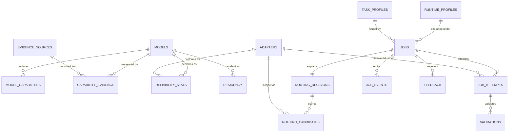

# LoadCoach — Data Model

**Database:** `loadcoach.sqlite3` (or PostgreSQL), owned exclusively by LoadCoach.
**Conventions:** [Database Standards](../../standards/database-standards.md).
**Corrected 2026-08-21** by the [final architecture audit](../../reviews/final_architecture_audit.md): ADR-0022 (evidence contract), ADR-0023 (`runtime_profiles`), ADR-0027 (per-device residency), ADR-0029 (queue mechanics).

---

## 1. Entity overview



**From 1.1** the routing, attempt, residency and reliability rows name an **execution subject**
rather than a model: a nullable `adapter_id` beside the existing `model_id`, plus the canonical
subject string written at decision time
([ADR-0080](../../adr/0080-a-persisted-decision-names-the-subject-by-reference-and-by-string.md)).
`adapter_id IS NULL` is the bare base, which is every row written before that migration.

**Four migrations, one per gate**, because a gate boundary is a commit boundary and a
half-applied composite migration is the worst thing to debug: `0009` creates `adapters` and puts
the subject on `routing_decisions` and `routing_candidates`, `0010` puts it on `jobs` and
`job_attempts` with the classification pair, `0011` moves the `residency` key onto the subject and
adds `routing_candidates.residency_detail_json`, and `0012` moves the `reliability_stats` key.
Each backfills what it can state as a fact — a candidate written before 1.1 decided about a bare
base, whose subject string *is* its model's canonical ID — and leaves `NULL` where a value would
be a reconstruction rather than a record.

**Adding a foreign key to a table that has children is a rebuild on SQLite**, and dropping a
parent with `foreign_keys=ON` cascades: `0009` would have deleted every stored routing candidate,
which is the explainability promise itself. The migration runner therefore enforces foreign keys
**off for the duration of a migration run** on SQLite and restores them after — through the raw
driver cursor, because the pragma is a documented no-op inside a transaction and the connection is
in one by the time SQLAlchemy would emit it. `0010`'s rebuild of `jobs` also re-creates the claim
index by hand, since alembic's reflection loses the `DESC` that migration `0004` exists to
establish.

---

## 2. Tables

### `models`
Identical identity columns to FreeWeight's — the same canonical identity, independently stored.

```text
id ULID PK · provider_kind · provider_model_name · artifact_digest NULL
provider_name TEXT NOT NULL DEFAULT ''      -- 1.1: the registration that serves it (ADR-0055);
                                            -- '' on rows discovered before named registration,
                                            -- and the kind for a singular [provider] block
is_remote BOOLEAN NOT NULL DEFAULT 0        -- the registration's declared `remote` flag, never
                                            -- inferred from the kind or the URL (ADR-0077 rule 4)
canonical_id · identity_confidence · descriptor_json · declared_capabilities_json
max_context · size_bytes · quantization · family · parameter_count
first_seen_at · last_seen_at · available BOOLEAN · unavailable_reason
UNIQUE (provider_kind, provider_model_name, artifact_digest)
```

Identity is unchanged: `provider_kind` is part of it and `provider_name` is not
([ADR-0008](../../adr/0008-canonical-model-identity.md)), so two registrations *of the same kind*
serving the same weights are one row, while the same weights under two different kinds are two rows
with separate evidence. Where two registrations of one kind serve one model, `provider_name` records
the one discovery last saw it on, and the models UI shows it.

### `model_capabilities`
Non-benchmark capability signals: declared flags, manual scores, priors.

```text
id ULID PK · model_id FK · capability_id · score NUMERIC NULL · confidence NUMERIC
source TEXT NOT NULL          -- declared | manual | prior | production
updated_at
UNIQUE (model_id, capability_id, source)
```

### `capability_evidence`
Imported from FreeWeight. Never edited by LoadCoach; recomputation is a re-import. The field set is
normative and matches the producer's — see
[ADR-0022](../../adr/0022-capability-evidence-record-contract.md).

```text
id ULID PK
model_id FK NULL                     -- NULL until bound to a discovered model
provider_kind · provider_model_name · artifact_digest NULL · canonical_id
                                     -- the identity is stored denormalized, so evidence can be
                                     -- imported before the model is discovered
match_state TEXT NOT NULL            -- bound | unmatched | ambiguous_name_only
runtime_profile_hash · machine_fingerprint
capability_id · score · confidence · sample_count · excluded_count · dispersion
benchmark_versions_json · dataset_hashes_json · prompt_subset_hashes_json
contributing_metrics_json · source_run_ids_json      -- opaque to LoadCoach
identity_confidence · environment_snapshot_json
measured_at                          -- latest completed_at among contributing runs; drives freshness
computed_at                          -- when the producer aggregated; never drives freshness
imported_at · source_id FK→evidence_sources
policy_version · vocabulary_version
stale BOOLEAN · stale_reason
record_json                          -- the capability.evidence payload exactly as it arrived
UNIQUE (source_id, canonical_id, runtime_profile_hash, machine_fingerprint,
        capability_id, policy_version)
```

`record_json` holds the producer's document unchanged. The columns above it are the queryable
projection ADR-0022 §1 makes normative; this is the document itself, kept because
[ADR-0025 §2](../../adr/0025-envelope-boundaries.md) requires `GET /evidence` to return real
`capability.evidence` envelopes and a payload rebuilt from the projection is missing fields the
projection does not carry — `model.observed_at` among them. It is also the strongest form of
"never edited by LoadCoach": a re-export is the producer's bytes rather than a reconstruction that
could drift from them.

`policy_version` is part of the key so two confidence policies coexist during a policy change and a
re-import is a row-wise upsert rather than a collision. `model_id` is nullable and `match_state`
records why: import never fails because a model has not been discovered yet, and binding is
re-evaluated on every discovery pass. Only `bound` evidence contributes to a routing score
([ADR-0022 §4](../../adr/0022-capability-evidence-record-contract.md)).
Index: `(canonical_id, capability_id)`, `(model_id, capability_id)`, `match_state`.

### `evidence_sources`
```text
id ULID PK · kind TEXT            -- freeweight_api | file | manual
url TEXT NULL · last_import_at · last_status · schema_version · record_count · error_text
```

### `runtime_profiles`
The settings an execution runs under. Referenced by jobs and matched against evidence
([ADR-0023](../../adr/0023-runtime-profile-resolution.md)). Mirrors FreeWeight's table so the hash
means the same thing on both sides.

```text
id ULID PK · profile_hash TEXT UNIQUE NOT NULL
context_size · kv_cache_precision · gpu_layers · flash_attention
threads · batch_size · keep_alive · provider_options_json · created_at
```
The all-`NULL` profile ("provider defaults") is an ordinary row with a stable hash.

### `task_profiles`
```text
id ULID PK · profile_id TEXT NOT NULL · version TEXT NOT NULL · description
weights_json · constraints_json · execution_json · validation_json
enabled BOOLEAN · created_at · updated_at
UNIQUE (profile_id, version)
```
Definitions ship as configuration and are imported into this table so a job can reference the exact
version it used.

### `jobs`
```text
id ULID PK · task_profile_id FK · task_profile_version
class TEXT · base_priority INT · effective_priority INT   -- maintained by the ageing sweep
source TEXT NOT NULL                        -- calling application identifier, from the authenticated
                                            -- token's name, or the X-Client-Name header on loopback,
                                            -- or "anonymous"; never caller-asserted when a token exists
state TEXT NOT NULL · state_reason TEXT
idempotency_key TEXT NULL · idempotent BOOLEAN
idempotency_expires_at NULL                 -- UNIQUE (source, idempotency_key); scoped per caller so
                                            -- two callers cannot collide, and expired after
                                            -- queue.idempotency_ttl_hours (default 24) so a key is
                                            -- not reserved forever
request_json                       -- prompt/messages by reference or hash, sampling, constraints, overrides
                                   -- messages carry tool_calls; the offered tools carry name,
                                   -- description and parameters (api.md §4) so a queued job
                                   -- replays the transcript and the offer it was submitted with
prompt_hash · prompt_text TEXT NULL   -- text only when content storage is enabled
response_hash · response_text TEXT NULL
structured_output_json NULL · tool_calls_json NULL
reasoning_available BOOLEAN · reasoning_summary TEXT NULL · reasoning_source TEXT NULL
selected_model_id FK NULL · runtime_profile_id FK NULL · runtime_profile_hash NULL
selected_adapter_id FK NULL · selected_subject_canonical_id TEXT NULL   -- ADR-0080
served_context INT NULL · served_context_source TEXT NULL   -- configured | reported | assumed
target_gpu_index INT NULL
attempt INT · max_attempts INT              -- attempt is written only by the executor, never by the
                                            -- claim query (ADR-0029 §2)
lease_owner TEXT NULL · lease_expires_at NULL · cancel_requested BOOLEAN
created_at · scheduled_for · queued_at · started_at · completed_at · max_wait_seconds
queue_wait_ms · provider_ms · loadcoach_overhead_ms · total_ms · ttft_ms
input_tokens · output_tokens · thinking_tokens NULL
cache_write_tokens NULL · cache_read_tokens NULL   -- ADR-0070: NULL is unreported, 0 is a count
validation_passed BOOLEAN NULL · degradations_json
error_code · error_text
```
Indexes: `(state, effective_priority DESC, created_at)` (the claim query),
`(source, idempotency_key)` unique,
`(state) WHERE state IN ('queued','waiting_resources','leased','executing')` (partial, where
supported), `(task_profile_id, created_at DESC)`, `(selected_model_id, created_at DESC)`,
`lease_expires_at`, `(state, queued_at)` (the ageing sweep).

### `job_attempts`
```text
id ULID PK · job_id FK ON DELETE CASCADE · attempt INT NOT NULL
model_id FK NULL · runtime_profile_hash · rank INT        -- 1 = primary, 2+ = fallback
adapter_id FK NULL · subject_canonical_id TEXT NULL       -- what answered (ADR-0080)
adapter_data_classification TEXT NULL                     -- the adapter's own classification
effective_data_classification TEXT NULL                   -- max(caller, adapter) (ADR-0065 rule 2)
started_at · completed_at · outcome TEXT                  -- completed|provider_error|timeout|
                                                          -- validation_failed|cancelled|context_exceeded
provider_ms · ttft_ms · input_tokens · output_tokens · finish_reason
cache_write_tokens NULL · cache_read_tokens NULL
error_code · error_text · partial_response_hash
UNIQUE (job_id, attempt)
```

### `validations`
```text
id ULID PK · job_attempt_id FK ON DELETE CASCADE · kind TEXT   -- json|json_schema|required_fields|regex|length
passed BOOLEAN · detail_json · duration_ms · created_at
```

### `routing_decisions`
```text
id ULID PK · job_id FK NULL          -- NULL for a /route call with no job
task_profile_id FK · task_profile_version · strategy_name · strategy_version
confidence_policy_version · requested_at · duration_ms
selected_model_id FK NULL · selected_adapter_id FK NULL · selected_score NUMERIC NULL
flags_json · evidence_summary_json · overrides_json · telemetry_snapshot_json
```

### `routing_candidates`
```text
id ULID PK · decision_id FK ON DELETE CASCADE · model_id FK
adapter_id FK NULL · subject_canonical_id TEXT NOT NULL   -- the subject as it was at decision time
rank INT NULL                        -- NULL when rejected
task_fit NUMERIC NULL · final_score NUMERIC NULL
capability_breakdown_json            -- per capability: weight, score, confidence, source, age, n
factors_json                         -- reliability, availability, residency, cost
rejected BOOLEAN · rejection_reason TEXT NULL · rejection_detail_json
residency_detail_json NULL           -- which residency level was applied, and both knobs' values
```
Index: `(decision_id, rank)`.

`subject_canonical_id` is written, never parsed
([ADR-0024 §4](../../adr/0024-model-identity-formatting-and-normalization.md),
[ADR-0080](../../adr/0080-a-persisted-decision-names-the-subject-by-reference-and-by-string.md)):
every question about *which* adapter is asked of `adapter_id`, and the string exists so an
explanation still renders what the system believed at the time after the adapter directory has
changed underneath it. A rejection whose reason is `adapter_classification_conflict` carries the
classification arithmetic in `rejection_detail_json`, and that row is the recorded denial I19 asks
for ([ADR-0079](../../adr/0079-an-adapter-classification-refusal-is-a-routing-rejection.md)).

### `job_events`
```text
id ULID PK · job_id FK ON DELETE CASCADE · sequence INT NOT NULL
timestamp · event_type · message · data_json
UNIQUE (job_id, sequence)
```

### `feedback`
```text
id ULID PK · job_id FK ON DELETE CASCADE · source TEXT NOT NULL
accepted BOOLEAN · quality_score NUMERIC NULL · edited BOOLEAN
validation_passed BOOLEAN NULL · validation_detail_json NULL · notes TEXT · created_at · updated_at
UNIQUE (job_id, source)
```

`validation_detail_json` holds the caller's own `validation.detail` from the request body
([API §6](api.md)): the reason a caller's check failed is the one part of feedback a person can act
on. `source` is set from the authenticated token's name, never from the body when a token is
present, which is what keeps one caller from overwriting another's verdict.

### `reliability_stats`
Rolling production evidence, recomputed incrementally.

```text
id ULID PK · model_id FK · task_profile_id · window TEXT         -- 7d | 30d | all
adapter_id FK NULL · adapter_key TEXT NOT NULL DEFAULT ''       -- the subject axis (ADR-0067);
                                                                -- the adapter's row id, '' = base
attempts · successes · validation_passes · errors · timeouts · cancellations
latency_count · p50_latency_ms NULL · p95_latency_ms NULL
output_token_count · mean_output_tokens NULL · tokens_per_second_count · mean_tokens_per_second NULL
feedback_count · acceptance_rate NUMERIC NULL · quality_count · mean_quality NUMERIC NULL
circuit_state TEXT · circuit_opened_at NULL · circuit_reason · updated_at
UNIQUE (model_id, adapter_key, task_profile_id, window)
```

**The key is the subject, not the base** ([ADR-0067](../../adr/0067-reliability-keys-on-the-subject-not-the-base.md)):
a failing `(base, adapterA)` opens its own breaker and leaves the bare base and every sibling
adapter servable. `adapter_key` carries the adapter's **row id**, and the empty string rather than `NULL` for the
bare base, because SQL treats `NULL`s in a unique index as distinct and a key that admits
duplicates is not a key
([ADR-0080](../../adr/0080-a-persisted-decision-names-the-subject-by-reference-and-by-string.md)
rule 5); `adapter_id` is the real foreign key beside it, and it repeats the same value on purpose
— the foreign key is nullable and goes `NULL` if an adapter row is ever removed, and a unique key
that moved when that happened would merge two subjects' history. The 20-sample minimum applies per subject,
so adapter subjects carry `low_evidence` until they have earned their own numbers — reported, never
borrowed from a neighbour.

Every statistic is stored beside the sample count that produced it (`*_count`) and is `NULL` below
a documented minimum — absent with a reason, never a plausible number over three attempts
([ADR-0016](../../adr/0016-unavailable-is-not-zero.md) rule 6). The minimums, the classification of
`job_attempts.outcome` into successes, errors and timeouts (a validation failure is an *answer*, as
the circuit breaker already counts it), the reliability factor's formula and the regression
threshold are `loadcoach.domain.reliability`'s named constants. `attempts` includes cancellations;
every rate's denominator excludes them, because a cancelled attempt says nothing about the model.
`task_profile_id` is the profile's string id, as on `jobs`, so statistics outlive a profile being
retired from configuration.

**An attempt row is written for every provider call, and a request refused before one is made ends
the job.** LoadCoach assembles one transcript of its own — the structured-output corrective retry
— and ModelRack can refuse it (an assistant turn with neither content nor tool calls is the case
found at G1). The refusal is not an attempt: no provider was called, so there is no row to write
for it. What must not happen is the loss of the rows for the attempts that *were* made: the job
moves to `failed` with `error_code = VALIDATION_ERROR` and every `job_attempts` row up to that
point is committed with its `outcome`, `finish_reason` and usage. Before this, such a job stayed
`executing` until a watchdog or a cancel and its attempts were never persisted, which made the
`finish_reason` behind an empty answer unrecoverable.

### `adapters`
The operator's directory, read into rows. Identity is the **artifact hash**; the path is a locator,
so a rename is safe and a content change is a different adapter
([ADR-0061](../../adr/0061-the-adapter-registry-is-a-directory-and-a-manifest.md) rule 5).

```text
id ULID PK
name TEXT NOT NULL                   -- the manifest's pin and display name
artifact_sha256 TEXT NOT NULL        -- the identity, normalized 'sha256:' + 64 lowercase hex
source_sha256 TEXT NULL              -- lineage only; never part of identity
artifact_path TEXT NOT NULL          -- a locator, relative to [adapters] directory
manifest_path TEXT NOT NULL          -- the reviewed manifest this row was read from
base_model_name TEXT NOT NULL · base_artifact_digest TEXT NULL
base_identity_confidence TEXT NOT NULL      -- digest | name_only (ADR-0058 §5)
declared_capabilities_json           -- validated vocabulary terms (ADR-0064 rule 1)
data_classification TEXT NOT NULL    -- required, no default (ADR-0065 rule 1)
adapter_format TEXT NOT NULL         -- 'gguf' in v1
manifest_json                        -- the model.adapter_manifest payload exactly as it arrived
created_at · first_seen_at · last_seen_at
available BOOLEAN · unavailable_reason TEXT NULL
UNIQUE (artifact_sha256)
```

`manifest_json` holds the operator's document unchanged, for the same reason
`capability_evidence.record_json` does: the row above it is the queryable projection, and a payload
rebuilt from a projection is not the payload that was reviewed. `available` goes false with a reason
when the artifact named by `artifact_path` is missing or its content no longer hashes to
`artifact_sha256` — fail closed, named by `doctor`, until a rescan
([ADR-0061](../../adr/0061-the-adapter-registry-is-a-directory-and-a-manifest.md) rule 5).
Index: `(name)`, `(base_model_name)`, `available`.

### `residency`
```text
id ULID PK · model_id FK · gpu_index INT NOT NULL
adapter_id FK NULL · adapter_key TEXT NOT NULL DEFAULT ''   -- the adapter's row id;
                                                            -- '' = the bare base (ADR-0080 rule 5)
loaded_at · last_used_at
vram_bytes NUMERIC NULL · vram_bytes_unavailable_reason TEXT NULL
resident BOOLEAN · unloaded_at NULL · unload_reason
UNIQUE (model_id, adapter_key, gpu_index, loaded_at)
```
Residency is two-level ([ADR-0066](../../adr/0066-residency-is-two-level.md)): what occupies a
device is the **base process**, and the adapter columns record which subject last used it. An
adapter switch on a resident base is not a load and writes no new row — it updates `last_used_at`
— which is what makes `residency_factor` free across adapters and expensive across bases
([Routing §6.1](routing.md)). `max_resident_models` is interpreted per `gpu_index`, and counts
bases, not subjects. The measurement column pair follows
`weightsdb.measurement_columns` — a value column plus its reason column, never a single column typed
"Measurement" ([Database Standards §3](../../standards/database-standards.md)).

### `api_tokens`, `settings`
As in FreeWeight ([FreeWeight Data Model](../freeweight/data-model.md)).

---

## 3. Retention

| Data | Default | Notes |
|---|---|---|
| Jobs and attempts | Forever | Configurable pruning by age or count |
| Job events | With the job | Pruned with the job |
| Routing decisions and candidates | Forever (`explanation_retention_days = 0`) | The explainability promise depends on this; pruning is opt-in and warns |
| Prompt/response text | Not stored unless enabled | Hashes always stored |
| Tool definitions and tool calls | With the transcript | `request_json.tools` is caller-written prompt content and `request_json.messages[].tool_calls` is model output; both are removed by the same scrub that removes the transcript, and `tool_calls_json` with them |
| Capability evidence | Upserted on re-import | Rows absent from a **complete** bundle are marked `superseded`, not deleted; an incremental bundle removes nothing ([ADR-0022 §5](../../adr/0022-capability-evidence-record-contract.md)) |
| Reliability stats | Rolling windows | Recomputed; `all` window never pruned |
| Adapters | Until removed from the directory | A row whose artifact is gone goes `available = false` with a reason; it is never deleted, so the decisions that named it stay readable |

---

## 4. Query-plan requirements

Asserted in tests:

* Claim query uses `(state, effective_priority DESC, created_at)` and never scans `jobs`.
* Queue depth uses the partial index on active states where the dialect supports it.
* Job list uses `(state, created_at DESC)` or `(task_profile_id, created_at DESC)`.
* Explanation retrieval uses `(decision_id, rank)`.
* Evidence lookup during routing uses `(model_id, capability_id)` and filters on
  `match_state = 'bound'`.
* The ageing sweep uses `(state, queued_at)` and never scans `jobs`.
* Reliability lookup uses `(model_id, adapter_key, task_profile_id, window)`.
* Adapter lookup during registry construction uses `adapters.artifact_sha256`.
* Lease reaping uses `lease_expires_at`.
