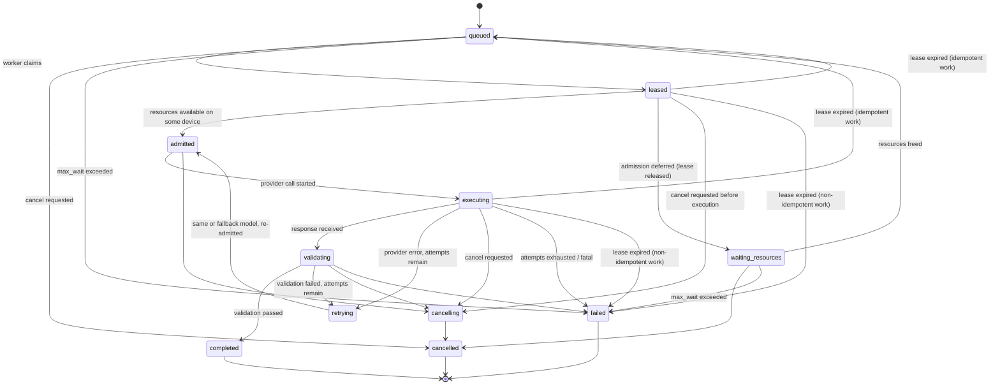

# LoadCoach — Queue and Scheduling

**Decision records:** [ADR-0010](../../adr/0010-queue-implementation.md) — a database-backed queue
worked by in-process threads. No broker, no Redis, no Celery.
[ADR-0029](../../adr/0029-queue-mechanics.md) — the mechanisms below: the ageing sweep, the attempt
counter, the admission states and the lease keeper.
[ADR-0027](../../adr/0027-multi-gpu-semantics.md) — per-device admission and residency.

The queue's hard problem is not throughput. It is deciding *which* work runs *when*, on a machine
with one GPU, without starving anyone, losing anything, or thrashing model loads.

---

## 1. Job classes and priorities

| Class | Priority band | Semantics | Example |
|---|---|---:|---|
| `interactive` | 800–999 | A human is waiting. Preempts scheduling order; short timeouts; never batched | A chat request from the UI |
| `normal` | 400–799 | Application work with a waiting caller | An IdeaPress draft stage |
| `background` | 100–399 | No one is waiting; may be deferred indefinitely under load | Bulk re-summarization |
| `batch` | 0–99 | Explicitly deferrable; grouped by model where possible | An overnight extraction sweep |

Effective priority rises with age (§4). A caller supplies a class and, optionally, a priority within
its band; the band itself is not escapable.

---

## 2. Job states



This transition table is normative and complete: every legal transition is listed, and a transition
not listed is rejected by the state machine and asserted as rejected by a test. Three of them were
added by [ADR-0029](../../adr/0029-queue-mechanics.md) to close gaps a claimed job could fall into —
`admitted` as an explicit state between claim and execution, `leased → waiting_resources` (which
**releases the lease**, so a job waiting on VRAM never holds a worker), and `leased → cancelling` for
a cancel that arrives after the claim and before the provider call.

Every transition is persisted with a timestamp and a reason, emitted as an event, and logged.

---

## 3. Claiming and leases

```sql
-- conceptually; executed as one atomic statement per dialect
UPDATE jobs
   SET state = 'leased', lease_owner = :worker, lease_expires_at = :now_plus_lease,
       updated_at = :now
 WHERE id = (
       SELECT id FROM jobs
        WHERE state = 'queued' AND scheduled_for <= :now
        ORDER BY effective_priority DESC, created_at ASC
        LIMIT 1)
RETURNING *;
```

**The claim does not touch `attempt`.** `jobs.attempt` is incremented in exactly one place — by the
executor, in the transaction that writes the `job_attempts` row — so first attempts, in-lease
corrective retries, fallbacks and post-requeue attempts all draw from one monotonic sequence and
`UNIQUE (job_id, attempt)` holds. Incrementing at claim time as well would collide the moment a job
retried in-lease and was later re-claimed, and `max_attempts` would stop meaning "at most this many
attempts" ([ADR-0029 §2](../../adr/0029-queue-mechanics.md)).

* Atomic claim: two workers can never hold the same job. On SQLite the statement runs inside
  `BEGIN IMMEDIATE`; on PostgreSQL `FOR UPDATE SKIP LOCKED` is used.
* Leases expire (default 60 s). They are renewed by a **lease keeper** on the scheduler thread, which
  renews the leases of every job this process is executing every `lease_renewal_interval_seconds`
  (default 20) and never blocks on a provider. The working thread cannot renew its own lease — it is
  inside a blocking call for up to `default_timeout_seconds` (300 s), five times the lease — so a
  self-heartbeat would guarantee that every long generation lost its lease and was reclaimed by
  another worker, which is the double-execution defect the atomic claim exists to prevent.
  `lease_seconds > 3 × lease_renewal_interval_seconds + slack` is validated at startup.
* An expired lease therefore means the **process** died or the scheduler stalled — both cases in which
  reclaiming is correct.
* Recovery on expiry follows the job's declared idempotency: idempotent work returns to `queued`;
  non-idempotent work fails with `worker_lost` rather than risking a duplicate side effect. Plain
  generation is idempotent; a job with a caller-supplied side effect is not.
* Workers poll with adaptive backoff (50 ms busy → 1 s idle) plus an in-process wake-up on enqueue,
  which is how the dispatch-latency budget is met without busy-waiting.

---

## 4. Ageing and starvation prevention

```text
effective_priority = base_priority + floor(waiting_minutes × ageing_priority_per_minute)
                     capped at the top of the job's class band + overflow_allowance

waiting_minutes    = now − queued_at        (time in waiting_resources counts as waiting)
```

`effective_priority` is a **stored column**, because the claim query's index
`(state, effective_priority DESC, created_at)` depends on it and an expression over `queued_at` in
`ORDER BY` would turn the hottest statement in the application into a scan. It is kept current by the
**ageing sweep**: one set-based `UPDATE` over `state IN ('queued','waiting_resources')`, on the
scheduler thread, every `queue.ageing_interval_seconds` (default 30). Startup recovery runs the same
sweep, so recovery and steady state share one code path.

Without the sweep, `effective_priority` would be written at enqueue and recomputed only at startup —
a long-running process would never age anything and the starvation bound below would be prose rather
than a mechanism ([ADR-0029 §1](../../adr/0029-queue-mechanics.md)).

* Default `ageing_priority_per_minute = 1`, `overflow_allowance = 100` — so a `background` job can
  eventually outrank a fresh `normal` job, but never a fresh `interactive` one. Ageing granularity is
  the sweep interval (30 s) against a policy of one point per minute, so the sweep is never the
  limiting factor.
* `max_wait_seconds` (default 3600, per job overridable) bounds the wait absolutely: on expiry the job
  fails with `MAX_WAIT_EXCEEDED` rather than waiting forever.
* A starvation counter (jobs waiting beyond a threshold) is exposed in `/system/status` and in health,
  and turns the queue component `degraded`.
* The scheduling simulation test asserts the bound: with a continuous stream of `interactive` work, a
  `background` job's wait must remain below the configured bound.

---

## 5. Admission control

Before a claimed job executes, admission checks the machine can actually run it:

```text
estimate_vram = model_size_bytes × loading_overhead_factor
              + kv_bytes_per_token × served_context
              + activation_overhead

fits = any( estimate_vram + vram_headroom_bytes <= free_vram(g) for g in visible_gpus )
```

Devices are evaluated **independently and never summed**: weights land on one device unless the
runtime is explicitly told to shard, so a machine with 8 GB free on each of two GPUs cannot run a
14 GB model, and adding the two figures would admit work that OOMs. The device that satisfied the
check is recorded as `target_gpu_index` on the job and in the explanation, with the per-device
numbers. Cross-device sharding is out of scope for 1.0
([ADR-0027](../../adr/0027-multi-gpu-semantics.md)).

`served_context` — not the descriptor's advertised maximum — is what the KV term multiplies
([ADR-0023](../../adr/0023-runtime-profile-resolution.md)). Estimating KV for a 131 072-token context
the provider will never serve rejects every candidate; estimating it for 4 096 when 32 768 is served
produces the OOM the estimate promised could not happen.

* Inputs: SweatMeter telemetry, model descriptor, runtime profile, and — when available — FreeWeight's
  measured `observed_kv_bytes_per_token`, which is far better than the theoretical figure. This is a
  concrete, non-cosmetic benefit of the two applications being connected.
* If the chosen model does not fit: try the next fallback candidate; if none fits, move the job to
  `waiting_resources` with the numbers recorded, and re-evaluate when a model unloads or telemetry
  shows headroom.
* Concurrency is capped by `execution.max_concurrent_jobs` (default 1). Above 1, admission applies to
  the aggregate estimate **per device**: concurrent jobs targeting GPU 0 sum against GPU 0's free
  VRAM, not against the machine's total.
* A job that does not fit moves to `waiting_resources` and **releases its lease**; it does not hold a
  worker slot while waiting.
* Admission never guesses optimistically: an unknown estimate is treated as "does not fit" unless the
  model is already resident.

---

## 6. Model residency

Loading a model can cost more than the inference itself, so residency is scheduled deliberately:

* `list_resident()` (where the provider supports it) tracks what is loaded and when it was last used.
* `max_resident_models` (default 1) and `unload_idle_seconds` (default 900) govern eviction, **per
  device**; the `residency` table carries `gpu_index`.
* The scheduler prefers, among close candidates, the resident one (`residency_factor` in
  [Routing §6](routing.md)); the bonus is deliberately small so residency never overrides capability.
* **Affinity batching:** among jobs of equal effective priority, the scheduler prefers one whose
  primary model is already resident. Bounded by `max_affinity_streak` (default 5) so affinity cannot
  itself become a starvation source.
* Before loading a model that does not fit alongside the resident set, the least-recently-used
  resident model is unloaded, and the load/unload is recorded as an event.
* Providers without residency control simply skip all of this; the behaviour degrades to "load on
  demand" with a recorded reason.

---

## 7. Retries, fallback and circuit-breaking

| Failure | Behaviour |
|---|---|
| Provider timeout | Retry on the same model up to `max_attempts` with backoff; then fall back |
| Provider connection error | Immediate fallback (retrying the same dead endpoint is pointless) |
| Provider protocol error | Retry once (transient truncation), then fall back |
| Structured-output validation failure | Retry with a corrective instruction (a versioned prompt record) up to the profile's limit, then fall back |
| Context limit exceeded | No retry on the same model; fall back to a larger-context candidate |
| Cancellation | Terminal; no retry |
| All candidates exhausted | `ALL_CANDIDATES_FAILED` with every attempt and reason recorded |

Backoff is exponential with jitter. Every attempt is a row in `job_attempts`, with model, outcome,
timings, tokens and error.

**Circuit breaker:** a model exceeding a failure-rate threshold within a window is deprioritized
(`recently_failing`) and excluded from candidacy until a cool-down elapses, after which it is
re-probed with a single low-priority job. The open state, its reason and its expiry are visible in the
UI and in the routing explanation of any decision that skipped the model.

---

## 8. Cancellation

* `POST /api/v1/jobs/{id}/cancel` sets a cancellation flag transactionally.
* `queued` / `waiting_resources` jobs are cancelled immediately.
* `executing` jobs are cancelled at the next stream boundary via ModelRack's cancellation token; the
  partial response is preserved on the attempt record.
* Cancelling never leaves a model loaded that policy would not have kept, never leaves an open
  connection, and never leaves a job in `cancelling` (a watchdog forces the terminal transition after
  a bounded time and records that it did).
* Cancellation is idempotent; cancelling a terminal job returns 409 `JOB_NOT_CANCELLABLE`.

---

## 9. Timeouts

| Timeout | Default | On expiry |
|---|---|---|
| Queue wait (`max_wait_seconds`) | 3600 s | `MAX_WAIT_EXCEEDED` |
| Attempt (`default_timeout_seconds`) | 300 s | Attempt fails; retry/fallback policy applies |
| Stream idle | 60 s without a chunk | Attempt fails as a timeout |
| Lease | 60 s, renewed by the scheduler's lease keeper every 20 s | Recovery per §3 |
| Cancelling watchdog | 30 s | Forced terminal transition, recorded |

All are configurable globally and per task profile; the effective values are recorded on the job.

---

## 10. Recovery after restart

On startup, before accepting work:

1. Release leases whose owner is not a live worker of this process.
2. `leased` / `executing` jobs → `queued` (idempotent) or `failed` with `worker_lost`
   (non-idempotent).
3. `cancelling` jobs → `cancelled`.
4. Re-evaluate `waiting_resources` jobs against current telemetry.
5. Run the ageing sweep (§4) — the same statement the scheduler runs every 30 s, not a separate
   startup-only path.
6. Log a reconciliation summary and emit events for every affected job.

Recovery is idempotent — running it twice changes nothing — and is covered by a test that kills the
process at several points in the lifecycle.

---

## 11. Queue observability

`GET /api/v1/queue` and `GET /api/v1/system/status` expose: depth by state and class, oldest queued
age, current dispatch latency, active executions with their models, residency and idle times,
starvation counter, circuit-breaker states, and recent throughput. The UI's Queue page renders exactly
this, live over SSE.

Health turns `degraded` when: depth exceeds a configured fraction of `max_depth`, the starvation
counter is non-zero, dispatch latency exceeds its ceiling, or any circuit breaker is open.

---

## 12. Testing the scheduler

A deterministic **scheduling simulator** over a fake clock and a fake provider is a first-class part of
the test suite:

* Priority ordering across classes; ageing over long horizons.
* Starvation bound under continuous high-priority load.
* Lease expiry and recovery for idempotent and non-idempotent work.
* Concurrency limit respected under a burst.
* Admission deferral and resumption as VRAM frees.
* Affinity batching improves model-load count without breaching the starvation bound.
* Cancellation at every state, including between claim and execution (`leased → cancelling`).
* Restart recovery from every non-terminal state, including `admitted`.
* Ageing under a **running** clock: with the simulated process alive and a continuous `interactive`
  stream, a `background` job's wait stays under the bound — the property the sweep exists to provide,
  and one a startup-only recomputation would pass by never being tested with the process up.
* Lease renewal across an attempt longer than `lease_seconds`: the job is not reclaimed while its
  worker is inside a blocking provider call, and it *is* reclaimed when the keeper stops.
* Per-device admission on a two-GPU fixture: a model larger than either device's free VRAM but
  smaller than their sum is deferred, not admitted.
* Throughput and dispatch latency under a mixed workload, asserted against the budgets.

The simulator uses no real time, no real provider and no real GPU, so these properties are verified on
every CI run rather than hoped for.
