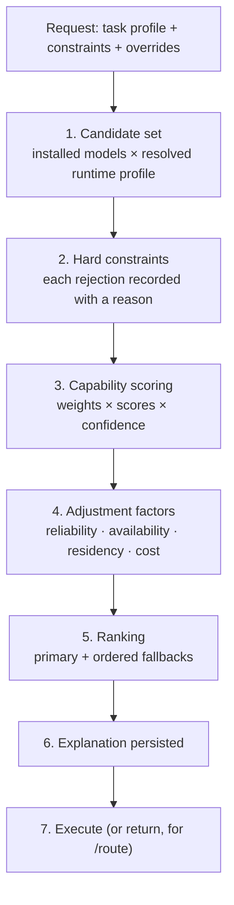

# LoadCoach — Routing and Explainability

**Owner:** LoadCoach. **Evidence policy:** [ADR-0017](../../adr/0017-benchmark-confidence-and-freshness.md).
**Rule:** every decision is explainable, and the explanation is persisted for every job — not sampled.
**Also normative:** [ADR-0023](../../adr/0023-runtime-profile-resolution.md) (execution subject and served context), [ADR-0027](../../adr/0027-multi-gpu-semantics.md) (per-device admission).

---

## 1. The pipeline



Steps 1–6 run for `POST /route` as well as for execution, so a caller can see the decision without
spending a GPU second.

---

## 2. Task profiles

A task profile is the routing intent, not a prompt.

```toml
[task_profiles."code.review"]
version = "1.2.0"
description = "Review a diff or file for defects, prioritising precision over recall."

[task_profiles."code.review".weights]         # must sum to 1.0 (validated)
code_review           = 0.45
reasoning             = 0.20
instruction_following = 0.15
structured_output     = 0.10
long_context          = 0.10

[task_profiles."code.review".constraints]
min_context_tokens        = 16384
requires_capabilities     = ["structured_output"]
max_latency_p95_seconds   = 120
min_capability_scores     = { code_review = 0.35 }
exclude_models            = []
allow_remote_providers    = false

[task_profiles."code.review".execution]
temperature       = 0.1
max_output_tokens = 4096
response_format   = "json_schema"
json_schema_ref   = "schemas/code_review_findings.json"
max_attempts      = 3
fallback_depth    = 2

[task_profiles."code.review".validation]
require_valid_json = true
require_schema     = true
required_fields    = ["findings", "summary"]
max_output_chars   = 200000
```

Rules: profiles are versioned; every job records the version it used; weights are validated to sum to
1.0; constraints are hard (they filter) while weights are soft (they rank); a profile may not
reference a capability outside the SetSpec vocabulary.

Shipped profiles: `general.chat`, `general.reasoning`, `general.summarize`, `code.generate`,
`code.review`, `code.debug`, `content.research_synthesis`, `content.outline`,
`content.article_draft`, `content.rewrite`, `content.edit`, `content.review`,
`content.fact_check`, `structured.extract`, `tools.agent`, `tools.agent.local_fast`,
`tools.agent.local_large`, `tools.agent.remote_cheap`, `tools.agent.remote_frontier`,
`tools.plan` — twenty.

The last five are **PromptCadence's harness profiles**, namespaced specializations of `tools.agent`
shipped as LoadCoach configuration rather than PromptCadence code
([ADR-0047 §1](../../adr/0047-a-tier-is-configuration-and-a-model-never-sizes-its-own-budget.md)).
A PromptCadence tier is a name over exactly one of them, so the four `tools.agent.*` profiles carry
the tier distinctions LoadCoach can express — a latency ceiling, a minimum served context equal to
the tier's `context_budget_tokens`, minimum capability scores and `allow_remote_providers` — and
nothing about model size, which LoadCoach has no vocabulary for. `tools.plan` is the planner's
intent: JSON out, validated as JSON, with **no** schema, because the plan document's shape stays
PromptCadence-internal. The two remote profiles ship with `allow_remote_providers = true` and route
to `NO_ELIGIBLE_MODEL` until a remote provider is registered; PromptCadence reports that as
`TIER_UNAVAILABLE`, which is visible rather than silent.

`content.review` reviews **prose** against a requirement set and returns structured findings. It is
weighted on `auditing`, `instruction_following`, `reasoning` and `structured_output`, and it exists
because reviewing writing and reviewing code are different routing intents that would otherwise be
served by one profile: `code.review` filters candidates on measured `code_review` capability and
imposes a code-review JSON schema, neither of which describes an audit of an article.

**A task profile never carries a prompt.** It carries intent, constraints, execution parameters and a
validation policy. A caller's prompt is passed to the provider unmodified
([Spec §9](spec.md)); the only prompt records LoadCoach applies are the ones it originates — the
structured-output corrective retry and the circuit-breaker re-probe — and each is recorded on the
attempt that used it.

---

## 3. Step 1 — Candidate set

Every model the registry knows, that the configured providers can currently serve. Models never seen
by discovery are not candidates. A model explicitly named in the request bypasses scoring but **not**
hard constraints (an override that would fail is refused with the reason, not silently honoured).

A candidate is not a model but an **execution subject**: the pair `(identity, resolved runtime
profile)`. The profile resolves before scoring, through
`[runtime].default → [runtime.models."<canonical_id>"] → task-profile runtime settings →
overrides.runtime_profile`, and its hash is what evidence must match
([ADR-0023](../../adr/0023-runtime-profile-resolution.md)). `RuntimeProfile()` — every field unset,
meaning "provider defaults" — is a legal profile with a stable hash; there is no unprofiled
execution.

From the resolved profile and the provider's capabilities, one further value is derived and recorded
on every candidate, because every context decision below depends on it:

```text
served_context = runtime_profile.context_size     when set               → source "configured"
                 provider-reported served context when exposed           → source "reported"
                 descriptor.max_context           otherwise, flagged     → source "assumed"
```

Where `ProviderCapabilities.context_configurable` is true and the task profile declares
`min_context_tokens`, LoadCoach **sets** `context_size` rather than hoping — so the common case is
`configured`, not `assumed`.

## 4. Step 2 — Hard constraints

Applied in this order; the first failure records the rejection and stops evaluating that candidate.

| Constraint | Rejection reason | Source |
|---|---|---|
| Model not available from any healthy provider | `model_unavailable` | Registry + provider health |
| **Served** context < `min_context_tokens` | `context_too_small` | Resolved profile + provider |
| Task profile needs a context the provider will not be asked to serve | `context_not_configurable` | `ProviderCapabilities.context_configurable` |
| Estimated context need > served context | `context_limit_exceeded` | Request + resolved profile |
| Missing a required capability (tools, structured output, vision) | `capability_unsupported` | Provider + declared capabilities, and the request itself ([ADR-0075](../../adr/0075-a-request-carrying-tools-requires-tool-use-of-every-candidate.md)) |
| Estimated VRAM need > free VRAM + headroom on **every** device | `insufficient_vram` | SweatMeter + estimate, evaluated per GPU ([ADR-0027](../../adr/0027-multi-gpu-semantics.md)) |
| Estimated RAM need > free RAM | `insufficient_ram` | SweatMeter |
| Capability score below `min_capability_scores` | `below_minimum_score` | Evidence |
| Model in `exclude_models`, or provider is remote while remote is disallowed | `excluded_by_policy` | Profile + config |
| Circuit breaker open for this model | `recently_failing` | Reliability stats |

A required capability comes from one of two places, and the rejection says which: the task
profile's `requires_capabilities`, or the request itself — a `POST /generate` body carrying a
non-empty `tools` requires `tool_use` of every candidate for that request alone
([ADR-0075](../../adr/0075-a-request-carrying-tools-requires-tool-use-of-every-candidate.md)). The
two are unioned, never traded off, and `capability_unsupported`'s detail carries
`required_by = "task_profile" | "request"` so a caller can tell a profile it chose from an offer it
made. A request-level capability filters; it never scores.

Every rejection is stored with the numbers that caused it (`needs 14.2 GB, 9.8 GB free on GPU 0,
7.1 GB free on GPU 1`), because "nothing was eligible" is useless without them. Advertised context is
never a constraint input; a model that advertises 131 072 tokens and will be served 4 096 is rejected
by `context_too_small`, not admitted and silently truncated.

`kind = "fake"` declares a small model by default so a fake-provider journey never trips
`insufficient_vram` on its own (E6, `docs/history/E6_HANDOFF.md`); `[provider.fake]`'s `size_bytes`, `layers`,
`kv_heads` and `head_dim` — set all four together, never a subset, since the KV term dominates
`size_bytes` at any interesting context length — let an operator provoke this rejection on purpose
and inspect the full `estimate` block it produces.

## 5. Step 3 — Capability scoring

```text
capability_score(model, capability) =
    evidence_score          when measured evidence exists
    declared_score          when only a declared capability exists   (see §5.1)
    absent                  otherwise   (contributes nothing; never 0)

task_fit(model) = Σ_c ( weight_c × score_c × confidence_c )
                  ─────────────────────────────────────────
                          Σ_c ( weight_c × present_c )
```

* Evidence contributes to a candidate **only when its `runtime_profile_hash` equals the candidate's
  resolved hash**, and its `machine_fingerprint` rules follow
  [ADR-0017](../../adr/0017-benchmark-confidence-and-freshness.md). Evidence for the same model under
  a different profile is neither reused nor scored zero: it is absent, named in the explanation as
  `evidence_profile_mismatch` with both hashes and the FreeWeight invocation that would produce
  matching evidence, and it counts toward `low_evidence` like any other absence.
* Evidence whose `match_state` is not `bound` — imported for a model discovery has not seen, or
  `name_only` against a local row that carries a digest — never contributes
  ([ADR-0022 §4](../../adr/0022-capability-evidence-record-contract.md)).
* `confidence_c` comes from FreeWeight's evidence
  ([ADR-0017](../../adr/0017-benchmark-confidence-and-freshness.md)). LoadCoach applies it; it never
  recomputes it. Its freshness derives from `measured_at`, so a producer that re-aggregates old runs
  does not present them as new.
* A capability with no evidence is **excluded from both numerator and denominator** and named in the
  explanation. Absence of evidence is not evidence of incapacity.
* When a profile's *total present weight* falls below a configured floor (default 0.5), the decision
  is flagged `low_evidence` and surfaced in the UI and API.

### 5.1 Declared-capability fallback (no FreeWeight)

With no measured evidence, LoadCoach uses a conservative prior derived from what is known without
measuring:

| Signal | Contribution |
|---|---|
| Provider-declared capability flags (tools, structured output, vision, thinking) | Gates hard constraints; contributes 0.5 as a neutral prior to the matching capability |
| Parameter count band (relative to other installed models) | Small prior toward general capability, capped |
| User-configured manual scores (`[manual_capabilities]` in configuration) | Used directly, marked `source: manual` |
| Production evidence from executed jobs | **Never a capability score** (§11, [ADR-0037](../../adr/0037-production-evidence-never-raises-capability-scores.md)). Acts only through the `reliability_factor` (§6, bounded 0.5–1.0) once the minimum sample count is reached: it can lower a model that fails in production, never raise one that succeeds |

Every such score is marked with its source and a fixed low confidence (default 0.3), so a single real
benchmark result outweighs any prior. Routing without FreeWeight is therefore *reasonable*, clearly
labelled, and **guarded rather than self-improving**: production evidence disciplines a failing
model through the reliability factor, the breaker and regression detection, while upward adaptation
from production success is deliberately deferred to post-1.0 exploration routing (spec §21,
ADR-0037). Scores improve when measurement arrives — a FreeWeight import, or a manual score.

## 6. Step 4 — Adjustment factors

```text
final_score = task_fit
            × reliability_factor
            × availability_factor
            × residency_factor
            × cost_factor
```

| Factor | Range | Definition |
|---|---|---|
| `reliability_factor` | 0.5–1.0 | From production evidence: validation pass rate, error rate, timeout rate for this task profile. Neutral (1.0) until the minimum sample count |
| `availability_factor` | 0.7–1.0 | Estimated queue-and-load cost: currently executing on this model, expected wait |
| `residency_factor` | 1.0–1.05 | Small bonus for an already-resident model (`prefer_resident_bonus`), because a cold load can cost more than the difference between two close candidates |
| `cost_factor` | 0.0–1.0 | 1.0 for local providers; configurable penalty for remote ones. Also enforces `allow_remote` as a hard constraint upstream |

Each factor's value and inputs are recorded. The residency bonus is deliberately small: it breaks
ties, it does not override capability.

`reliability_factor` is `0.5 + 0.5 × success_rate × validation_pass_rate × feedback_term`, computed
from the freshest of the `7d` and `30d` windows holding at least the minimum sample count
(`PRODUCTION_MINIMUM_SAMPLES`, 20 counted attempts; cancellations never count) — never from `all`,
so a bad day ages out of the factor within thirty days rather than following a lightly used model for
ever. `success_rate` is
answered over counted attempts, `validation_pass_rate` validated over answered, and `feedback_term`
is `1 − 0.5 × (1 − acceptance_rate)` once at least five caller verdicts exist in the window and `1`
before. Every term is in `[0, 1]`, so the factor lands in `[0.5, 1]` without a clamp; the window,
the rates and one sentence saying why travel with the decision as `factors.reliability_detail`,
whether the factor is live or neutral.

## 7. Step 5 — Ranking and fallbacks

Candidates are ordered by `final_score` descending, ties broken by (higher confidence, then resident,
then lower estimated VRAM, then canonical ID) — a **total order**, so routing is deterministic and
reproducible given the same inputs.

The primary is rank 1; fallbacks are ranks 2…(1 + `fallback_depth`). Fallbacks are used when:
an attempt fails with a provider error, validation fails after the profile's retries, the model
becomes unavailable mid-flight, or the context turns out not to fit.

Fallback is never silent: the job records each attempt with its model, outcome, and the reason the
next candidate was tried.

## 8. Step 6 — The explanation

Persisted for every routing decision:

```json
{
  "decision_id": "01J9K…",
  "task_profile": {"id": "code.review", "version": "1.2.0"},
  "strategy": {"name": "weighted_evidence", "version": "1.0.0"},
  "confidence_policy_version": "1.0.0",
  "requested_at": "2026-08-21T09:14:02.318Z",
  "duration_ms": 18,
  "selected": {"canonical_id": "ollama/qwen3.5:9b-q8_0@sha256:1f3a9c4e2b70",
               "runtime_profile_hash": "8f2c…", "final_score": 0.71, "rank": 1,
               "served_context": 32768, "served_context_source": "configured",
               "target_gpu_index": 0},
  "fallbacks": [{"canonical_id": "ollama/gemma4:12b@…", "final_score": 0.63, "rank": 2}],
  "candidates": [
    {"canonical_id": "ollama/qwen3.5:9b-q8_0@…",
     "task_fit": 0.74, "final_score": 0.71,
     "capabilities": [
       {"capability": "code_review", "weight": 0.45, "score": 0.68, "confidence": 0.62,
        "source": "benchmark", "evidence_age_days": 12, "sample_count": 40},
       {"capability": "long_context", "weight": 0.10, "score": null, "confidence": null,
        "source": "absent", "note": "no evidence; excluded from the weighted mean"},
       {"capability": "reasoning", "weight": 0.20, "score": null, "confidence": null,
        "source": "evidence_profile_mismatch",
        "note": "evidence measured under runtime profile 4a91…, executing under 8f2c…",
        "remedy": "freeweight run start --model … --context-size 32768 --kv-cache-precision f16"}],
     "factors": {"reliability": 0.98, "availability": 1.0, "residency": 1.05, "cost": 1.0}}
  ],
  "rejected": [
    {"canonical_id": "ollama/llama4:70b@…", "reason": "insufficient_vram",
     "detail": {"estimated_bytes": 41000000000,
                "free_bytes_by_gpu": {"0": 9800000000, "1": 7100000000}}}
  ],
  "flags": ["low_evidence"],
  "evidence_summary": {"source": "freeweight", "imported_at": "2026-08-09T…",
                       "oldest_measured_at": "2026-07-28T…",
                       "bundle_schema_version": "1.0", "policy_version": "1.0.0",
                       "vocabulary_version": "1.0", "stale": false,
                       "unmatched_records": 3},
  "overrides": null
}
```

Retrievable at `GET /api/v1/jobs/{id}/explanation` and rendered in the UI as a readable table with
the numbers behind every figure. Retention is configurable and defaults to forever.

## 9. Context budgeting

Before executing, LoadCoach estimates the context requirement and either fits the request or rejects
it with numbers:

```text
estimated_input_tokens  = measured or estimated prompt tokens (provider tokenizer when available,
                          otherwise a documented character-based estimate with its ratio recorded)
required_context        = estimated_input_tokens + max_output_tokens + safety_margin
usable_context          = served_context   (never descriptor.max_context)
```

If `required_context` exceeds `usable_context`: try a candidate with a larger context; or,
when the profile permits, reduce `max_output_tokens` down to the profile's floor and record the
reduction; otherwise reject with `CONTEXT_LIMIT_EXCEEDED` and the numbers. Truncating the user's input
is never done silently — it requires an explicit request option.

## 10. Manual overrides

| Override | Effect |
|---|---|
| `model` | Bypasses scoring; hard constraints still apply; recorded as `override: model` |
| `runtime_profile` | Uses the given context/KV settings; recorded |
| `sampling` | Overrides profile execution parameters; recorded |
| `disallow_fallback` | Fails instead of falling back; recorded |
| `require_evidence` | Refuses to route on declared/manual priors; fails with `NO_ELIGIBLE_MODEL` and the reason |

Every override appears in the explanation, so a surprising decision can always be traced to the
instruction that caused it.

## 11. Production evidence and reliability

Every completed attempt updates per `(model, task_profile)` statistics: attempts, successes,
validation pass rate, error and timeout rates, p50/p95 latency, tokens per second, mean output tokens.
Caller feedback (`accepted`, `rejected`, `edited`, optional quality score) is folded in with its own
weight.

Uses: the `reliability_factor`; the circuit breaker (a model failing more than a configured rate over
a window is deprioritized and eventually excluded with `recently_failing`, then re-probed after a
cool-down); and regression detection (a significant drop against a model's own baseline raises a
warning in the UI and in health).

The breaker's samples are the same attempt rows the statistics are computed from, classified by the
same rule — a validation failure is an *answer*, an error or timeout is not — over its own ten-minute
window (queue §7); its verdict is persisted onto `reliability_stats` so the page and `GET /reliability`
show it without the serving process. Regression detection compares the `7d` window's validated-success
rate with the model's own history *before* that window and fires only when the drop is at least 15
points **and** its two-proportion z-score is at least 2.0, with at least 20 counted attempts on each
side; noise with the same underlying rate clears neither test. Production evidence never enters
capability scoring: it acts through the factor, the breaker and regression detection, and the
explanation shows it under `factors.reliability_detail` with `source: production` beside the
benchmark entries in `capabilities` with `source: benchmark`.

Production evidence never overwrites benchmark evidence — the two are separate sources with separate
confidence, and both are shown.

## 12. Determinism and testability

Given the same registry, evidence, telemetry snapshot, reliability statistics and request, routing
produces the same decision. This is a tested property: the scoring functions are pure, all inputs are
injected, and a golden-decision test asserts stability. It is what makes routing debuggable at all.
