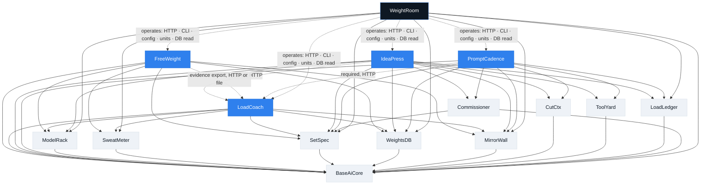
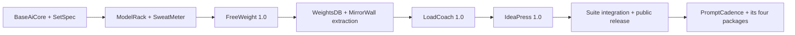

# Executive Summary

**Suite:** a local-first toolkit for operating open-weight AI models.
**Components:** four applications (FreeWeight, LoadCoach, IdeaPress, PromptCadence), ten shared
Python packages, and — specified 2026-09-09, unbuilt — a fifth application above them, WeightRoom,
the host operator's console ([ADR-0123](../adr/0123-weightroom-is-a-host-operator-tool-above-the-layer-rules.md)).
**Status:** architecture frozen 2026-08-21, audited and corrected the same day
([final architecture audit](../reviews/final_architecture_audit.md), ADR-0022 – ADR-0029).
All fourteen components are built and tagged; the
[master roadmap §9](../roadmap/master-roadmap.md#9-current-state-and-immediate-next-steps) holds the
per-component versions.

---

## 1. Purpose

Running open-weight models locally is cheap, private and fast — and almost entirely unmeasured.
Users pick models by reputation, guess at context limits until something out-of-memories, and
discover a model's weaknesses in production. This suite closes that loop with three products that
each stand alone and compose when combined:

```text
Measure AI   →   Manage AI   →   Apply AI
FreeWeight       LoadCoach       IdeaPress
```

* **FreeWeight** measures what a model can actually do *on this machine* — capability, speed,
  memory, reliability — and records enough provenance that the measurement can be reproduced and
  compared.
* **LoadCoach** turns those measurements into decisions: given a task, the installed models, the
  current state of the hardware and a queue of work, it chooses a model, executes the request, and
  can explain exactly why it chose what it chose.
* **IdeaPress** applies models to real work — turning an idea into finished content through
  configurable, validated workflows in which Python owns the control flow and models perform
  bounded tasks.

## 2. Suite vision

A user should be able to install any one of these four applications, run one command, and have a
working local AI tool that never phones home. A user who installs two should get more than the sum:
benchmark evidence makes routing intelligent, and intelligent routing makes content workflows
faster, cheaper and more reliable — without a single line of workflow code changing.

## 3. Component overview

### Applications

| Application | Answers | Owns | Default port |
|---|---|---|---:|
| **FreeWeight** | "How well does this model perform on this machine, for this capability?" | Benchmark definitions, execution, scoring, result history, provenance, evidence export | 8765 |
| **LoadCoach** | "Given this task and this machine right now, which model should run it, and how?" | Task profiles, routing, queue, execution, validation, retries/fallback, routing explanations, production feedback | 8766 |
| **IdeaPress** | "How do I turn this idea into finished content?" | Workflow definitions, projects, stages, drafts, validation gates, exports | 8767 |
| **PromptCadence** | "How do I let an agent loop run tools and models under a plan, a budget and a policy?" | Trajectories, tiers, plans and approvals, the `ExecutionIntent`, the agent loop, transcripts, deviations, the composed explanation | 8768 |
| **WeightRoom** *(specified, unbuilt)* | "How do I run this machine — from another room?" | The one LAN-facing HTTPS console: process control, unified logs and audit, settings forms over each application's schema, the docs viewer, chat through LoadCoach and PromptCadence, the guarded database viewer, the model catalog, costs, backups, jobs, alerts, prompts | 8769 |

### Shared packages

| Package | Provides | First consumer |
|---|---|---|
| **BaseAiCore** | Canonical model identity, machine profile, capability IDs, the `Unsupported` measurement sentinel, IDs, timestamps, domain errors | All |
| **SetSpec** | Versioned cross-application schemas: benchmark results, capability evidence, machine profiles, event and error envelopes | FreeWeight |
| **ModelRack** | Provider-neutral model discovery, metadata, generation and streaming (Ollama, OpenAI-compatible, llama.cpp with hot-swappable LoRA adapters) | FreeWeight |
| **SweatMeter** | CPU/RAM/GPU/VRAM/thermal/power telemetry and static machine profiling | FreeWeight |
| **WeightsDB** | SQLAlchemy engine/session setup, SQLite pragmas, migration runner, backup, health checks | LoadCoach (then adopted by FreeWeight) |
| **MirrorWall** | Design tokens, layout and component macros, SSE helpers, JSON/error envelopes, request IDs, telemetry widgets | LoadCoach (then adopted by FreeWeight) |
| **CutCtx** | Transcript representation, compaction policies and the plans they produce; the package plans, the application executes | PromptCadence (then IdeaPress) |
| **ToolYard** | Tool specifications, registry, validation, tiered isolation and structured refusal for model-directed tool calls | PromptCadence |
| **LoadLedger** | Budget accumulation, ceilings and verdicts over ADR-0030's cost types; mountable tables, no migration history | PromptCadence (then IdeaPress) |
| **Commissioner** | Ordered data classification, egress verdicts and the append-only decision ledger; the Python form of `governance.egress_decision` | PromptCadence (then IdeaPress) |

## 4. Dependency model

Dependencies point one way only: applications depend on packages; packages depend on
infrastructure; nothing depends on an application.



Solid arrows are Python imports. Dotted arrows are **optional** connections over versioned HTTP
contracts, never imports and never shared databases — with one named exception: WeightRoom, the
operator's tool, also reads the four databases (read-only, or under a guard) and their
configuration files, and drives their units, because the operator already could
([ADR-0123](../adr/0123-weightroom-is-a-host-operator-tool-above-the-layer-rules.md)). It never
imports an application.

## 5. Independent deployment

Every application is independently installable, independently versioned, and independently useful:

| Scenario | Works? | What you get |
|---|---|---|
| FreeWeight alone | Yes | Full benchmarking, comparison, export |
| LoadCoach alone | Yes | Routing from declared model capabilities and live resources; no benchmark evidence |
| IdeaPress alone | Yes | Full content workflows against Ollama or any OpenAI-compatible endpoint |
| FreeWeight + LoadCoach | Yes | Routing backed by measured evidence, with confidence and freshness weighting — for the runtime profile the evidence was measured under, which LoadCoach names in the explanation when it differs |
| IdeaPress + LoadCoach | Yes | Automatic model selection, queueing, validation and fallback per workflow stage |
| PromptCadence + LoadCoach | Yes | A governed agent loop; PromptCadence reaches models **only** through LoadCoach ([ADR-0045](../adr/0045-promptcadence-reaches-models-only-through-loadcoach.md)), so LoadCoach is its one required peer |
| All four | Yes | Measured → managed → applied and harnessed, end to end |
| IdeaPress + FreeWeight, no LoadCoach | Yes | They simply do not interact; IdeaPress never requires FreeWeight |
| WeightRoom over any subset | Yes | One HTTPS console on the LAN; an application that is absent shows as *not installed*, one that is stopped shows as *stopped* with a start button; nothing requires it and it requires nothing to start |

Three rules make this hold, and CI enforces them:
1. No application imports another application's Python modules.
2. No application reads or writes another application's database.
3. All cross-application traffic uses a versioned public API or a versioned exported file.

WeightRoom is the one component excepted from rules 2 and 3 — by an enumerated list, read-only
by default, audited, and never from rule 1 ([ADR-0123](../adr/0123-weightroom-is-a-host-operator-tool-above-the-layer-rules.md)).

## 6. Major benefits

* **Local-first.** Default binding is `127.0.0.1`; no content leaves the machine unless the user
  explicitly configures a remote provider, and the UI marks that configuration as data egress.
* **Evidence over folklore.** Model choice becomes a measurement with provenance, sample counts,
  confidence and an expiry, rather than an opinion.
* **Explainable routing.** Every LoadCoach decision retains its candidates, scores, hard-constraint
  rejections and fallback ordering.
* **Reproducible measurement.** Every benchmark result carries the model digest, runtime profile,
  provider version, machine fingerprint, benchmark version and dataset hashes needed to reproduce
  or invalidate it.
* **Honest degradation.** A missing GPU, an absent provider, an unreadable sensor or stale evidence
  produces an explicit state — never a fabricated zero and never a crash.
* **Genuine reuse.** One Ollama client, one telemetry implementation, one model identity, one set of
  UI primitives, shared through installable versioned packages — not copies and not submodules.

## 7. Development order

Packages are built when the first application actually needs them, and every phase ends in
something demonstrable.



Named release milestones: **M1** package foundation · **M2** FreeWeight beta · **M3** FreeWeight
1.0-rc and contract freeze · **M4** LoadCoach beta (WeightsDB and MirrorWall extracted) · **M5**
LoadCoach 1.0 · **M6** FreeWeight 1.0 · **M7** IdeaPress beta · **M8** IdeaPress 1.0 (optional
LoadCoach backend) · **M9** suite 1.0 public release. The two post-1.0 arcs continue the numbering:
**M10** harness foundations (CutCtx, ToolYard, LoadLedger, Commissioner) · **M11** PromptCadence
beta · **M12** PromptCadence 1.0 · **M13** IdeaPress's adoption of three of the new packages, with
the adapter arc's **LA0–LA3** running beside them. The
[Master Roadmap](../roadmap/master-roadmap.md) defines each milestone's content, its exit criteria,
and what can proceed in parallel; the [PromptCadence](../roadmap/promptcadence-roadmap.md) and
[Adapter](../roadmap/adapter-roadmap.md) roadmaps own M10–M13 and LA0–LA3.

## 8. What this suite deliberately is not

* Not a model training, fine-tuning or quantization tool.
* Not a multi-tenant hosted service, and not a cluster scheduler. Single-machine first; a second
  machine is an explicit future extension, not a hidden assumption.
* Not a hosted control plane. WeightRoom operates *this* host for *this* operator; it is not a
  fleet manager and not a multi-user portal.
* Not a general agent framework. IdeaPress runs *bounded* model tasks inside Python-owned control
  flow, and PromptCadence is a governed harness over LoadCoach — an application you run, not a
  library you embed.
* Not a leaderboard. FreeWeight measures *your* models on *your* hardware and refuses to collapse
  that into one universal number.
* Not dependent on Kubernetes, Redis, Celery, RabbitMQ or Kafka. Nothing in the current
  requirements justifies them; see [ADR-0010](../adr/0010-queue-implementation.md).
