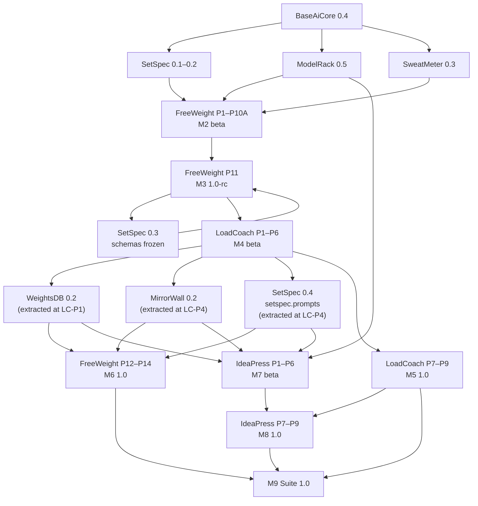

# Master Development Roadmap

**From:** empty repositories (architecture frozen 2026-08-21).
**To:** four professionally deliverable applications and ten published packages (three and six when
this line was written; the PromptCadence and adapter arcs added the rest — see §1's M10–M13 table).
**State (2026-09-07):** M1–M8 and the post-1.0 milestones M10–M12 are complete; M13's content
shipped with `ideapress 1.2.0` and awaits only its declaration, and M9 — the delivery checklist in
§7 — has now been walked by an audit (`~/ai/suite/M9_AUDIT.md`) whose gaps are rows L1–L6 of
[Outstanding Work](outstanding-work.md). §9 has the per-component table.
**Corrected 2026-08-21** by the [final architecture audit](../reviews/final_architecture_audit.md):
the prompt library moves from FreeWeight P7 into P6 (the fingerprint needs it), `setspec.prompts` is
extracted at LoadCoach P4 alongside MirrorWall, and LoadCoach P3 gains the VRAM estimator its
constraint filter requires.
**Sequencing principle:** dependency order and rework risk, not calendar dates. No phase is dated,
because a single-maintainer project's calendar is a fiction; every phase instead has prerequisites,
acceptance criteria and an exit condition.
**Amended 2026-08-26** by [ADR-0031](../adr/0031-user-defined-goal-benchmarks.md) and
[ADR-0032](../adr/0032-judge-validity-and-user-capability-namespace.md): FreeWeight gains three
phases (P8A, P8B, P10A — user-defined goal benchmarks) between its existing P8 and P11, and SetSpec
gains Phase 3A (capability vocabulary 1.1, the goal payload schemas), landing inside the existing
`setspec 0.3` release rather than as a new one. M2 and M3's content and exit conditions below are
updated accordingly; no milestone number, package range or cross-application dependency edge moved.

---

## 1. Milestones

| #      | Milestone                                | Content                                                                            | Exit condition                                                                                                     |
| ------ | ---------------------------------------- | ---------------------------------------------------------------------------------- | ------------------------------------------------------------------------------------------------------------------ |
| **M1** | Package foundation                       | BaseAiCore 0.4 · SetSpec 0.1–0.2 (draft payloads) · ModelRack 0.5 · SweatMeter 0.3 | A script using only these packages discovers a model, generates text, and prints machine telemetry                 |
| **M2** | FreeWeight beta                          | FreeWeight P1–P10A                                                                 | A real model is benchmarked end to end; results are drillable, comparable and exportable; a subjective goal can be authored, calibrated and scored entirely from the UI ([P10A](../apps/freeweight/development-plan.md#phase-10a--the-goal-authoring-wizard-and-starter-packs--completes-m2-beta)) |
| **M3** | FreeWeight 1.0-rc · **contract freeze**  | FreeWeight P11 (built on P8A/P8B/P10A) · SetSpec 0.3 (schemas frozen incl. capability vocabulary 1.1 and the goal payloads, goldens published) | An evidence bundle is consumed by a `setspec`-only harness with no FreeWeight code or DB access, including a calibrated `user.*` goal record |
| **M4** | LoadCoach beta · **extraction complete** | LoadCoach P1–P6 · WeightsDB 0.2 · MirrorWall 0.2 · SetSpec 0.4 (`setspec.prompts`) | LoadCoach routes, executes, streams and imports FreeWeight evidence; two applications share the extracted packages |
| **M5** | LoadCoach 1.0                            | LoadCoach P7–P9                                                                    | Explainable, durable, secure routing service; published to PyPI                                                    |
| **M6** | FreeWeight 1.0                           | FreeWeight P12–P14                                                                 | FreeWeight on the shared packages, external adapters, hardened; published to PyPI                                  |
| **M7** | IdeaPress beta                           | IdeaPress P1–P6                                                                    | A complete project is produced and exported with **only Ollama** present                                           |
| **M8** | IdeaPress 1.0                            | IdeaPress P7–P9                                                                    | Optional LoadCoach backend; hardened; published to PyPI                                                            |
| **M9** | Suite 1.0                                | Integration verification, cross-repository CI, documentation set, public release   | Every gold standard met; all install paths verified; release notes published                                       |

**M10–M13 are post-1.0 and are planned elsewhere.** M10–M12 are built; M13 is the last row. The
[PromptCadence arc](promptcadence-roadmap.md) owns them — the harness application, its four shared
packages, LoadCoach's multi-provider registration and IdeaPress's adoption phases — with the
[Adapter arc](adapter-roadmap.md) (LA0–LA3) running as a parallel stream that shares M10's contract
phase and converges at M12. Their decisions are ADRs
[0045–0067](../adr/README.md), accepted 2026-09-02 before any of their code.
[Outstanding Work](outstanding-work.md) is the execution schedule for both, one row per session.

| # | Milestone | Owned by | Ships |
|---|---|---|---|
| **M10** | Harness foundations | [PromptCadence arc §3](promptcadence-roadmap.md) | `baseaicore 0.4.1`, `setspec 0.5.0`, CutCtx/ToolYard/LoadLedger/Commissioner at `0.1.0` |
| **M11** | PromptCadence beta | [PromptCadence arc §3](promptcadence-roadmap.md) | `promptcadence 0.9.0b0` |
| **M12** | PromptCadence 1.0 | [PromptCadence arc §3](promptcadence-roadmap.md) | `promptcadence 1.0.0`, LoadCoach `1.1.0` (LC-E1) |
| **M13** | Adoption — extraction complete | [PromptCadence arc §6](promptcadence-roadmap.md) | IdeaPress `1.2.0` on LoadLedger, Commissioner and CutCtx (shipped 2026-09-07; declaration outstanding) |

This roadmap stays authoritative for M1–M9 and for the sequencing principle both arcs inherit.

---

## 2. Dependency graph

The one non-obvious edge is **FreeWeight P11 → SetSpec 0.3 → FreeWeight P11**: the schemas are frozen
only after FreeWeight has produced real results against the draft models, and FreeWeight's evidence
export then ships against the frozen schemas. Freezing a contract before its producer exists is a
guess; this ordering makes it an observation.

---

## 3. Work streams and what can proceed in parallel

Four streams. Within a stream, phases are strictly ordered; across streams, the table states what may
overlap.

| Stream | Contents |
|---|---|
| **A — Foundation packages** | BaseAiCore, SetSpec, ModelRack, SweatMeter |
| **B — FreeWeight** | FreeWeight P1–P14 (18 phases total: adds P8A, P8B, P10A for user-defined goal benchmarks) |
| **C — LoadCoach + extractions** | LoadCoach P1–P9, WeightsDB, MirrorWall |
| **D — IdeaPress** | IdeaPress P1–P9 |

```mermaid
gantt
    dateFormat X
    axisFormat %s
    title Sequencing by dependency (units are phases, not time)

    section A Foundation
    BaseAiCore P1-P4         :a1, 0, 4
    SetSpec P1-P3            :a2, after a1, 3
    ModelRack P1-P5          :a3, after a1, 5
    SweatMeter P1-P4         :a4, after a1, 4
    SetSpec P4 freeze        :a5, 15, 1

    section B FreeWeight
    FW P1-P2 skeleton+storage :b1, after a1, 2
    FW P3-P4 models+telemetry :b2, after a3, 2
    FW P5-P9 + 8A/8B engine+benchmarks+goals :b3, after b2, 7
    FW P10-P10A UI+goal wizard (M2)         :b4, after b3, 2
    FW P11 evidence (M3)                    :b5, after b4, 1
    FW P12-P14 adopt+ext (M6) :b6, after c2, 3

    section C LoadCoach
    LC P1-P4 + WeightsDB + MirrorWall (M4 pt1) :c1, after b5, 4
    LC P5-P6 queue+evidence (M4)               :c2, after c1, 2
    LC P7-P9 feedback+UI+harden (M5)           :c3, after c2, 3

    section D IdeaPress
    IP P1-P6 standalone (M7)  :d1, after c1, 6
    IP P7-P9 loadcoach (M8)   :d2, after c3, 3

    section Suite
    M9 Suite 1.0              :e1, after b6, 2
```

### 3.1 Explicit parallelism rules

| These may run concurrently | Because |
|---|---|
| ModelRack P1–P5 and SweatMeter P1–P4 | Both depend only on BaseAiCore; no shared surface |
| SetSpec P1–P3 and ModelRack/SweatMeter | SetSpec does not depend on either |
| FreeWeight P1–P2 and ModelRack P3–P5 | FreeWeight's skeleton and storage need no provider |
| FreeWeight P8A and FreeWeight P8 | P8A's only prerequisite is P7; it does not need P8's judge infrastructure. P8B is the join point — it needs both P8 and P8A complete |
| FreeWeight P12–P14 and LoadCoach P7–P9 | Different repositories; FreeWeight P12 needs only the *published* WeightsDB/MirrorWall |
| IdeaPress P1–P6 and LoadCoach P5–P9 | IdeaPress standalone needs no LoadCoach, only the extracted packages |
| IdeaPress P1–P6 and FreeWeight P12–P14 | Entirely independent |
| Documentation and hardening within any application's final phases | Different files, same acceptance gate |

| These may **not** overlap | Because |
|---|---|
| FreeWeight P11 and SetSpec P4 (freeze) | Circular by design; sequence is draft → real results → freeze → export |
| FreeWeight P9 and FreeWeight P8A–P8B | P9 depends only on P6 and P8, not on the goal phases; both branches must finish before P10A, but neither blocks the other |
| LoadCoach P1 and FreeWeight's storage refactor | WeightsDB is extracted *from* FreeWeight; FreeWeight must be stable first |
| MirrorWall extraction and FreeWeight UI changes | The extraction is a move, not a copy; a moving target breaks it |
| IdeaPress P7 and LoadCoach P1–P9 | The LoadCoach backend requires a stable, released LoadCoach API (M5) |
| Any two GPU-bound work streams on the reference machine | One GPU; benchmark measurements are invalid when shared |

### 3.2 The single-maintainer reality

With one person, "parallel" means *unblocked*, not *simultaneous*. The practical ordering that
minimizes context switching is: finish stream A; drive stream B to M3; drive stream C to M4; then
alternate between B (P12–P14) and D (P1–P6) as each hits a natural pause; finish C to M5; finish D;
then M9. The parallelism table above matters mainly for deciding what to pick up when something is
blocked — for example, when a live benchmark run is occupying the GPU for an hour.

---

## 4. Integration milestones

Points where two components must actually work together. Each has a dedicated verification, and none
is considered complete on the basis of a code review.

| # | Integration | At | Verification |
|---|---|---|---|
| **I1** | FreeWeight ↔ ModelRack | FW P3 | Discovery through ModelRack only; no provider HTTP code in FreeWeight (asserted) |
| **I2** | FreeWeight ↔ SweatMeter | FW P4 | Telemetry bar live; machine profile persisted; no-GPU path exercised |
| **I3** | FreeWeight → SetSpec | FW P6, frozen at FW P11 | Exported results validate against schemas and goldens |
| **I4** | FreeWeight → LoadCoach (evidence) | LC P6 | A bundle produced by FreeWeight changes LoadCoach routing, verified with **no shared code and no shared database**; a `user.*` goal capability in the bundle changes nothing unless a task profile names it explicitly ([ADR-0032 §6](../adr/0032-judge-validity-and-user-capability-namespace.md)) |
| **I5** | WeightsDB ↔ two applications | LC P1, FW P12 | Two schemas, two migration histories, one package; FreeWeight's test suite passes unchanged after adoption |
| **I6** | MirrorWall ↔ two applications | LC P4, FW P12 | Both applications' template suites render against the same version in CI |
| **I7** | IdeaPress ↔ LoadCoach | IP P7 | Backend switch changes no workflow code; degradation and version mismatch handled; feedback lands in LoadCoach's reliability stats; every task ID in `LOADCOACH_TASK_MAP` exists in the running LoadCoach's `/task-profiles`; the prompt LoadCoach forwards equals the prompt IdeaPress rendered |
| **I9** | Prompt hashing across components | LC P4, FW P12 | The same prompt record hashes identically under FreeWeight's, LoadCoach's and IdeaPress's installed `setspec`, and FreeWeight's pack hashes unchanged across the adoption |
| **I8** | Full suite | M9 | All three running together on one machine; every optional link exercised on and off |

---

## 5. Stabilization phases

Stabilization is scheduled work, not what happens if there is time left.

| Phase | When | Content | Gate |
|---|---|---|---|
| **S1 — Foundation stabilization** | End of M1 | Package APIs reviewed against their first real consumer; breaking changes made now while everything is `0.x`; golden values locked | Every package installs alone, type-checks from a consumer, ≥ 95 % coverage |
| **S2 — FreeWeight stabilization** | FW P14 (M6) | Performance budgets, security checklist, accessibility audit, upgrade testing from every released version, documentation | All FreeWeight acceptance criteria and gold standards met |
| **S3 — LoadCoach stabilization** | LC P9 (M5) | Auth and LAN-exposure review, scheduling simulation at scale, security checklist, operations documentation | All LoadCoach acceptance criteria and gold standards met |
| **S4 — IdeaPress stabilization** | IP P9 (M8) | Model-output sanitization sweep, archive-import hardening, performance, documentation | All IdeaPress acceptance criteria and gold standards met |
| **S5 — Suite stabilization** | M9 | Cross-repository compatibility matrix, install-path verification, documentation consistency review, dependency audit, release notes. **No package-1.0 range widening**: M9 bumps no package, and every application's declared range is proved at both ends by the matrix instead ([ADR-0113](../adr/0113-packages-stay-0x-at-m9-and-1-0-is-earned-per-package.md), [Packaging Standards §4 and §7](../standards/packaging-and-release-standards.md)) | Every item in §7 checked |

---

## 6. Version trajectory

**Packages**

| Component | M1 | M2 | M3 | M4 | M5 | M6 | M8 | M9 | M10–M13 | Today |
|---|---|---|---|---|---|---|---|---|---|---|
| BaseAiCore | 0.4 | 0.4 | 0.4 | 0.4 | 0.4 | 0.4 | 0.4 | 0.4 | 0.4.1–0.4.2 | **0.4.2** |
| SetSpec | 0.2 | 0.2 | **0.3** (frozen) | 0.4 | 0.4 | 0.4 | 0.4 | 0.4 | 0.5–0.6 | **0.6.0** |
| ModelRack | 0.5 | 0.5 | 0.5 | 0.5 | 0.5 | 0.6 | 0.6 | 0.6 | 0.7 | **0.7.1** |
| SweatMeter | 0.3 | 0.4 | 0.4 | 0.4 | 0.4 | 0.4 | 0.4 | 0.4 | 0.4 | **0.4.0** |
| WeightsDB | — | — | — | **0.2** | 0.2 | 0.2 | 0.2 | 0.2 | 0.2 | **0.2.1** |
| MirrorWall | — | — | — | **0.2** | 0.2 | 0.2 | 0.2 | 0.2 | 0.2 | **0.2.2** |
| CutCtx | — | — | — | — | — | — | — | — | **0.1** (M10) | **0.1.0** |
| ToolYard | — | — | — | — | — | — | — | — | **0.1** (M10) | **0.1.1** |
| LoadLedger | — | — | — | — | — | — | — | — | **0.1** (M10) | **0.2.0** |
| Commissioner | — | — | — | — | — | — | — | — | **0.1** (M10) | **0.1.1** |

**Applications**

| Component | M2 | M3 | M4 | M5 | M6 | M8 | M9 | M10–M13 | Today |
|---|---|---|---|---|---|---|---|---|---|
| FreeWeight | **0.9-beta** | 1.0-rc | 1.0-rc | 1.0-rc | **1.0** | 1.0 | 1.0 | 1.1 (LA3) | **1.1.0** |
| LoadCoach | — | — | **0.9-beta** | **1.0** | 1.0 | 1.0 | 1.0 | 1.1 (M12, LA2) | **1.1.3** |
| IdeaPress | — | — | — | — | — | **1.0** | 1.0 | 1.1–1.2 (LA2, M13) | **1.2.0** |
| PromptCadence | — | — | — | — | — | — | — | **0.9-beta** (M11) → **1.0** (M12) → 1.2 | **1.2.0** |

**FreeWeight is `0.9-beta` at M2**, not `0.1.0`. The trajectory used to start it at M3, which left
the version of a feature-complete application undecided and understated ten delivered phases to
anyone reading the version alone. `0.9-beta` says the true thing — every phase through 10A is
built; the contracts are not frozen until M3 — and mirrors LoadCoach's own beta. In PEP 440 that is
`0.9.0b0`; the tag is cut at M2 exit, not before, because the exit condition is a demonstration on a
real model rather than a state of the source.

SetSpec's M4 column is **0.4**, not 0.3: `setspec.prompts` is extracted during LoadCoach P4
([ADR-0028](../adr/0028-prompt-pack-granularity.md)). The schema freeze at M3 is unaffected —
prompt tooling is additive and the frozen payload schemas do not change.

SetSpec's M3 column, `0.3 (frozen)`, also carries capability vocabulary **1.1** and the
`benchmark.goal_pack` / `benchmark.calibration_report` schemas
([ADR-0031](../adr/0031-user-defined-goal-benchmarks.md),
[ADR-0032](../adr/0032-judge-validity-and-user-capability-namespace.md)). These land via
[SetSpec Phase 3A](../packages/setspec/development-plan.md#phase-3a--capability-vocabulary-11-and-the-goal-payloads),
which ships inside the same `0.3.0` release as Phase 4 rather than as a separate one — no version
pin in any consuming `pyproject.toml` changes.

**Corrected at M5 (2026-08-30), and again at row L2 (2026-09-07).** The M5 correction removed
bumps that had no phase behind them — BaseAiCore at 0.5 and ModelRack at 0.6 from M4, MirrorWall at
0.3 at M5 — and deferred the rest to M6. The L2 correction finishes the job: the M6 and M8 columns
had BaseAiCore reaching 0.6, ModelRack 0.7, WeightsDB 0.3 and MirrorWall 0.3 then 0.4, and none of
those happened either. Those columns now record what each package actually was at each milestone,
the four PromptCadence-arc packages have rows, and a **Today** column carries each repository's
`__about__.py` so the forecast and the fact sit side by side. A version bump with no change behind
it is exactly the fiction the FreeWeight note above argues against, and a forecast left standing
after the fact is the same fiction told backwards. SetSpec's M4 column reads 0.4 for the reason
stated below.

**No package reaches 1.0 at M9** ([ADR-0113](../adr/0113-packages-stay-0x-at-m9-and-1-0-is-earned-per-package.md),
2026-09-07, superseding this section's earlier "packages reach 1.0 only at M9, when all three
applications have exercised them"). A package reaches 1.0 when its public surface has survived two
consecutive minors with no breaking change **and** the cross-repository compatibility matrix
([Packaging Standards §7](../standards/packaging-and-release-standards.md)) is green on both ends
of every application's declared range for it. Each package earns that on its own schedule; there is
no cohort bump, and no milestone confers it. Until then each application's `<0.x+1` ceiling is the
contract, and widening one is a deliberate act with a lock recompile behind it.

Applications reach 1.0 when their own acceptance criteria pass — an application at 1.0 depending on
a `0.x` package is deliberate and honest, and the compatible-range pinning in
[Packaging Standards](../standards/packaging-and-release-standards.md) makes it safe. That is the
state the suite ships in today, on purpose: four `1.x` applications over ten `0.x` packages.

---

## 7. M9 — Professional delivery checklist

Nothing here is optional; each maps to requirement §37.

**Restated 2026-09-07 (row L2) over fourteen components and four applications.** The checklist was
written when the suite was nine components and three applications; `outstanding-work` §1.1 declares
M9 over fourteen, and the boxes below say so. The four applications are FreeWeight, LoadCoach,
IdeaPress and PromptCadence; the ten packages are BaseAiCore, SetSpec, ModelRack, SweatMeter,
WeightsDB, MirrorWall, CutCtx, ToolYard, LoadLedger and Commissioner.

**Installation and distribution**
- [ ] `pip install freeweight|loadcoach|ideapress|promptcadence` into a clean venv, each starting with zero configuration
- [ ] `pipx install` verified for all four
- [ ] All ten packages installable and importable standalone
- [ ] `python -m <app>` works for all four
- [ ] Optional extras (`[postgres]`/`[postgresql]`, and IdeaPress's `[telemetry]`) install and function

**Releases**
- [ ] Every component released from a tag by CI with Trusted Publishing; no manual upload has ever occurred
- [ ] Semantic versions, changelogs and release notes for every component
- [ ] Compatibility matrix published per application (tested package ranges)
- [ ] Checksums published for application artifacts

**Documentation**
- [ ] README per repository with purpose, install, quickstart and links
- [ ] Configuration reference per application, generated and CI-diff-checked
- [ ] API documentation per application: OpenAPI snapshot plus a written guide
- [ ] `--help` complete and correct at every CLI level
- [ ] Web UI help/about page per application
- [ ] Troubleshooting guide per application, aligned with `<app> doctor`
- [ ] Security documentation: trust boundaries, exposure, egress, sandboxing
- [ ] Backup and restore procedure per application, tested
- [ ] Upgrade guide from every released version; rollback considerations documented
- [ ] Developer documentation and `CONTRIBUTING.md` per repository
- [ ] This documentation set reviewed for consistency (§8) and published

**Quality**
- [ ] Every gold standard in [Gold Standards](../standards/gold-standards.md) met and measured
- [ ] Coverage floors met in every repository
- [ ] Performance budgets measured on the reference machine and published with the machine described
- [ ] Security checklist complete; `pip-audit` and `gitleaks` clean
- [ ] Accessibility checklist complete for all four UIs
- [ ] Cross-repository compatibility matrix green over four applications × {lowest, highest} pin of every suite package

**Operations**
- [ ] Migration path tested from every released version with real data
- [ ] Downgrade procedure exercised: upgrade, write data, restore the pre-migration backup, start the
      older version — and a database ahead of the code refuses with `SchemaAhead` naming both revisions
- [ ] Every application's declared range for every suite package resolves at **both ends** in a clean
      venv and passes its contract and e2e suites, proved by the compatibility matrix. *(Restated by
      [ADR-0113](../adr/0113-packages-stay-0x-at-m9-and-1-0-is-earned-per-package.md): M9 bumps no
      package to 1.0, so "admit the 1.0 packages" is no longer the property being checked.)*
- [ ] Backup/restore tested on both dialects
- [ ] `<app> doctor` diagnoses every documented failure mode
- [ ] Degradation matrix exercised end to end for all four applications, every row indexed to the
      test that proves it ([graceful degradation §2.1](../architecture/graceful-degradation.md))

---

## 8. Documentation consistency review (repeated before every milestone)

The review in [§9 of this roadmap](#9-current-state-and-immediate-next-steps) is run at each
milestone, not only at M9. It checks: component names, public contracts, model identity terms,
configuration precedence, API conventions, database ownership, no cross-application DB access, no
package importing an application, each application independently runnable, the optional links, tests
planned before implementation, acceptance criteria present in every phase, and rationale recorded for
every architectural decision. Any drift is fixed in the documentation before the milestone is
declared.

---

## 9. Current state and immediate next steps

**Current state (2026-09-07, verified at row L2 against every `__about__.py`, every repository's
pushed tags and the PyPI index).** The architecture is frozen, `docs/` is complete, and **all
fourteen components are built and tagged.** The four applications reached 1.0.0 in milestone order —
LoadCoach (M5), FreeWeight (M6), IdeaPress (M8, after its M7 verification's findings were closed and
ADR-0039 was accepted and implemented) and PromptCadence (M12). The version in the table below is
each repository's `__about__.py`, which is the authoritative number; where PyPI has not caught up
the table says what is tagged and what the index holds.

One release is stuck rather than pending: **LoadCoach `v1.1.0`, `v1.1.2` and `v1.1.3` are all tagged
and pushed, and none of them triggered a `release.yml` run**, so the index is still at `1.0.0`.
Publishing it is not an operator approval waiting to be given — it is a workflow that never fired,
and it needs a look before the M9 release boxes can be ticked.

| Component | Version | On PyPI | State |
|---|---|---|---|
| BaseAiCore | 0.4.2 | 0.4.2 | Complete through its plan. `0.4.1` added `DataClassification` and `AdapterIdentity` for the two arcs |
| SetSpec | 0.6.0 | 0.6.0 | Payloads frozen at 1.0; additive minors at 0.5.0 (`governance.egress_decision`, the adapter manifest) and 0.6.0 (evidence bundle 1.1) |
| ModelRack | 0.7.1 | 0.7.1 | P1–P8 complete, including `LlamaCppProvider` and hot-swappable LoRA adapters (LA1) |
| SweatMeter | 0.4.0 | 0.4.0 | Complete |
| WeightsDB | 0.2.1 | 0.2.1 | P1–P3 complete |
| MirrorWall | 0.2.2 | 0.2.2 | P1–P3 complete |
| CutCtx | 0.1.0 | 0.1.0 | P1–P2 complete |
| ToolYard | 0.1.1 | 0.1.1 | P1–P3 complete, sandbox included. One in-suite consumer (PromptCadence) |
| LoadLedger | 0.3.0 *(prepared)* | 0.2.0 | P1–P3 published; `0.3.0` takes the pricing-file reader ([ADR-0110](../adr/0110-the-pricing-file-reader-is-a-loadledger-surface.md)), committed and untagged |
| Commissioner | 0.1.1 | 0.1.1 | P1–P2 complete |
| FreeWeight | 1.1.0 | 1.1.0 | P1–P15 complete, adapter-aware through LA3; tagged 2026-09-07 and published by CI |
| LoadCoach | 1.1.3 | **1.0.0** | P1–P9 plus LC-E1, the adapter work (LA2) and the settings-precedence fix (row I8). `v1.1.0`, `v1.1.2` and `v1.1.3` tagged and pushed; **no release run fired for any of them** |
| IdeaPress | 1.3.0 *(prepared)* | 1.2.0 | P1–P9 (M8), the per-stage adapter pins, and the M13 adoption phases; `1.2.0` tagged 2026-09-07 and published by CI, `1.3.0` committed and untagged (row K3) |
| PromptCadence | 1.2.0 | 1.2.0 | P1–P9 complete (M12), plus runtime settings and the `settings` verb; tagged 2026-09-07 and published by CI |
| WeightRoom | 0.0.0 | — | **Specified 2026-09-09** (row W0; ADRs 0123–0127; `apps/weightroom/*`); the fifth application, unbuilt; rows W1–W10 in [`weightroom-work.md`](weightroom-work.md); distribution `openweight-gym` |

**What remains, in two independent tracks.**

1. **M9 — the professional delivery checklist** (§7 above), over all fourteen components as they
   stand. It predates both arcs and appears in neither; it neither gates nor is gated by any arc
   row, so it can run at any time. The audit session it asked for has now run
   (`~/ai/suite/M9_AUDIT.md`, 2026-09-07): **9 of 28 items met outright, 10 partial, 9 unmet**, with
   none of the gaps architectural. Its seven gap groups are scheduled as rows L1–L6 of
   [Outstanding Work](outstanding-work.md). §7 above is the restated checklist; the declaration
   itself is a human step.
2. **M13 — adoption**, the last milestone of the [PromptCadence arc](promptcadence-roadmap.md).
   Everything in both arcs is built: M10–M12 and LA0–LA3 ran row by row between 2026-09-02 and
   2026-09-06, and their contracts — ADRs [0045–0067](../adr/README.md), plus the sixty-odd taken
   during the builds — are accepted. M13's content, IdeaPress taking LoadLedger, Commissioner and
   CutCtx as their second consumer, shipped as `ideapress 1.2.0` on 2026-09-07
   ([Outstanding Work](outstanding-work.md) rows J1 and J2). Declaring the milestone is a human
   step; the arcs stay authoritative for rationale, and each finished row's
   `docs/history/<ROW>_HANDOFF.md` records what it actually built.

Of the releases that were pending on 2026-09-06, `freeweight 1.1.0`, `ideapress 1.2.0` and
`promptcadence 1.2.0` were tagged and published by CI on 2026-09-07. What remains is
`loadcoach 1.1.3` (tagged, unpublished — see the note above the table) and `loadledger 0.3.0`
(committed, untagged). Tagging and PyPI approval stay a human step by standing instruction.

**The record of how each milestone was verified** stays in the handoff and verification documents:
`docs/history/M4_HANDOFF.md`, `docs/history/M6_HANDOFF.md` and `docs/history/M7_HANDOFF.md` are where the decisions the
documents left open were made, and `docs/history/m5-reverification.prompt.md`, `docs/history/m6-verification.prompt.md` and
`docs/history/m7-verification.prompt.md` are how each milestone was checked before it was declared. The M7
verification is the precedent worth keeping in view: it returned *not ready*, with findings that
took a further build round to close.

An implementation agent assigned any phase should read, in this order: the master requirements, the
[Master Architecture](../architecture/master-architecture.md), the relevant component
[specification](../README.md), that phase in the component's development plan, and the standards it
touches. It should not need to invent an architectural decision; if it does, that gap is a defect in
this documentation set and should be closed with an ADR before the code is written. The
[final architecture audit](../reviews/final_architecture_audit.md) is still worth reading before a
first phase: it added ADR-0022 – ADR-0029 and corrected the specifications they touch. The M4 and
M5 handoff sections in `docs/history/M4_HANDOFF.md` are where the decisions the documents left open
were made, and the verification prompts are how each milestone is checked before it is declared.
