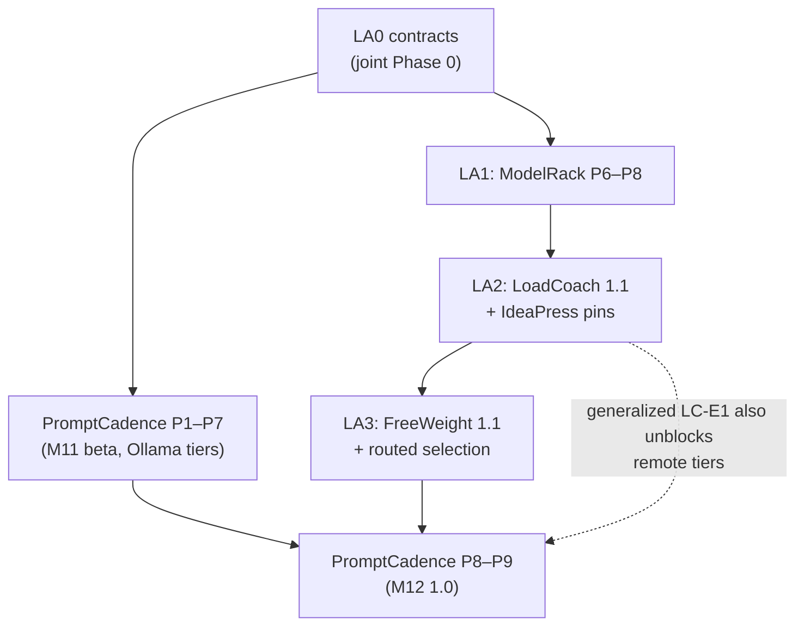

# Adapter Arc — Hot-Swappable LoRA Production Plan

**From:** the design discussion of 2026-09-01, resolved in
[Adapter Identity and Serving](../architecture/adapter-identity-and-serving.md).
**To:** per-request LoRA selection on a warm base (llama.cpp), adapter-aware identity and
evidence, routed and pinned adapter selection through LoadCoach, and adapter use in IdeaPress and
PromptCadence — with every contract change additive.
**Sequencing principle:** unchanged — dependency order and rework risk, no dates.
**Relationship to the [PromptCadence arc](promptcadence-roadmap.md):** not before, not after —
**contracts first, implementation as a parallel stream, converging at PromptCadence P9 (M12)**.
The arc's Phase LA0 lands jointly with PromptCadence's Phase 0 so every new schema in the suite
is born adapter-aware; the serving and routing work then proceeds independently, and IdeaPress's
adapter pins (the fact-check / judge / write case) ship as soon as LA2 lands, without waiting for
the harness at all.

---

## 1. What was decided, in one paragraph

llama.cpp is the adapter-serving runtime (vLLM deferred — no concurrency payoff on this
hardware); Ollama stays for zero-ops adapter-free serving; both register under the **generalized
LC-E1**. The execution subject gains a content-addressed adapter axis; adapter-serving mode lives
in the runtime-profile hash. The registry is an operator directory plus a SetSpec manifest.
Evidence is measured, never inherited, and routing enforces "no benchmark, no use" as arithmetic
plus one gate. Selection rides the capability vocabulary (namespaced specializations and
`user.*`), pinned or routed — never free-form tags. Residency splits into cheap adapter switches
and penalized base switches, with a per-request override. Adapters are local-only, classified
artifacts. One adapter at a time. Full rationale: the
[architecture document](../architecture/adapter-identity-and-serving.md).

## 2. Decisions and the ADRs that must exist before code

Written and accepted at LA0, numbered sequentially in the ADR index at writing time; A-ids are
stable references for this plan.

| ID | Decision (stated unambiguously) | Revisit when |
|---|---|---|
| **A-1** | The execution/measurement subject gains an optional, content-addressed **adapter axis** — `AdapterIdentity(name, artifact_digest, source_digest?)`, hashed from the served GGUF; canonical form gains a `+name@sha256:…` suffix. Amends ADR-0008/0023/0024 additively; an absent adapter is byte-for-byte today's subject. Base compatibility is verified by digest, fail closed; name-only matches carry reduced identity confidence. | A provider serves adapters by reference rather than artifact, breaking content-addressing |
| **A-2** | **Adapter evidence is measured, never inherited.** A new adapter subject has no evidence; its panel is its declared capabilities + a fixed regression panel + performance. Extends the ADR-0016/0037/0043 family. | Never for inheritance; the panel composition may evolve with measured forgetting data |
| **A-3** | **Selection lives in the subject; serving mode lives in the runtime profile.** Adapter-enabled serving is the config default for llama.cpp tiers; the clean-vs-registered overhead is a FreeWeight A/B, not an assumption. | The measured serving-mode overhead is material on reference hardware — flip the default |
| **A-4** | **The registry is a directory + `model.adapter_manifest` (SetSpec 1.0).** Operator-owned, opt-in per app (`[adapters] directory`, empty = off); FreeWeight and LoadCoach read it independently; ModelRack validates and mounts; `loadcoach adapters scan` drafts manifests, humans keep them. Identity is the hash, the path is a locator — renames are safe, content changes are new subjects. | A third reader class appears (a manifest *service* is still not the answer until then) |
| **A-5** | **`LlamaCppProvider`**: one base per llama-server process, spawned/terminated through the existing `Provider.load/unload` seam; every compatible manifest adapter pre-registered at launch (`--lora`, `--lora-init-without-apply`); per-request `lora` selection; new adapter files fold in at next idle (`pending_restart`), never mid-work. `ProviderCapabilities.adapter_hot_swap` is load-bearing; Ollama declares `False`. | llama.cpp gains runtime adapter registration (drop the restart machinery); the server API breaks (fixtures are version-annotated, as Ollama's are) |
| **A-6** | **One adapter at a time.** No composition, no scale-mixing. | A concrete consumer need, with the identity-of-a-weighted-set problem solved first |
| **A-7** | **Selection rides the capability vocabulary.** Adapters declare and are measured on namespaced specializations and `user.*` goals; task profiles weight them; routed selection is ordinary scoring; pinned selection is `model`-override semantics; `require_adapter_evidence` (default on) filters unmeasured adapter subjects with a named rejection. No free-form tag channel exists. | A selection need the vocabulary's specialization rule cannot express |
| **A-8** | **Adapters are local-only, classified artifacts.** Every manifest carries `data_classification`; effective classification is `max(caller, adapter)`; a would-be adapter egress is a recorded SpotCheck denial. | A remote provider offers adapter upload under terms an operator accepts — a new ADR, not a flag |
| **A-9** | **Two-level residency**: (resident base process, registered adapters). Adapter switch is free and counts as resident; base switch carries a configurable `base_switch_penalty`; a per-request `ignore_residency` override zeroes both terms, recorded in the explanation. | Multi-GPU residency (two bases warm) changes the cost surface |
| **A-10** | **Reliability and the breaker key on the subject.** A failing adapter never breaks its base or siblings; cross-adapter attribution is a human's read of per-subject rows in v1. | Fragmented samples make per-subject reliability useless in practice — revisit pooling rules explicitly |

## 3. The stream and its checkpoints

Four phases, LA0–LA3. LA0 is joint with PromptCadence Phase 0; LA1–LA3 run as their own stream.

| # | Checkpoint | Content | Exit condition |
|---|---|---|---|
| **LA0** | Contracts (joint with PromptCadence Phase 0) | ADRs A-1…A-10 · BaseAiCore adapter types (additive: 0.4.x before the M9 1.0 pass, 1.1.0 after) · SetSpec `model.adapter_manifest` 1.0 + `CapabilityEvidence` v1.1 optional fields, goldens for both · PromptCadence schemas, fake-LoadCoach shapes and `trajectory_explanation` 1.0 born with optional adapter fields | A `setspec`-only script validates a manifest golden and an adapter-bearing evidence golden; a non-adapter evidence record round-trips byte-identically to today's |
| **LA1** | Serve | ModelRack P6–P8 (§4.1): `LlamaCppProvider` with process supervision, adapter registration/selection, conformance + cache-correctness suites, recorded fixtures; capability flags; `AdapterNotFound` | On the reference machine: one llama-server base, three registered adapters; a scripted sequence alternates adapters across 20 generations with **zero base loads** (asserted from the process table and load timings) and the cache-correctness test passes |
| **LA2** | Route, pinned | LoadCoach 1.1 (§4.2): generalized LC-E1, adapter registry rows + `adapters scan`, subject expansion + compatibility filter + classification filter, pins, two-level residency, per-subject reliability · IdeaPress per-stage pins (§4.4) | The motivating demo: an IdeaPress project whose fact-check, judge and draft stages pin three adapters on one base — total base loads across the project: **one**; every attempt's provenance names its subject |
| **LA3** | Route, on evidence | FreeWeight 1.1 (§4.3): adapter enumeration, panels + regression panel, serving-mode A/B, evidence export with adapter fields · LoadCoach routed selection live behind `require_adapter_evidence` · PromptCadence tiers select adapter subjects where evidence exists (§4.5) | An imported bundle visibly changes which adapter a task profile selects, with the explanation showing per-capability adapter evidence beside the bare base; an unmeasured adapter is filtered with the named rejection; converges at or before PromptCadence P9 (M12) |

## 4. Per-component work

### 4.1 ModelRack — Phases P6–P8 (target: next minor, e.g. 0.7.0)

* **P6 — process supervision + basic serving.** `LlamaCppProvider`: spawn/health-wait/terminate
  llama-server; GGUF discovery and hashing from a configured model directory (identity confidence
  *bound*, better than tag-based); profile flags (`n_gpu_layers`, cache types, flash attention,
  template override); generation + streaming over the native API; error translation; recorded
  fixtures, version-annotated. Risks: orphaned processes (kill-tree on timeout, pid files),
  port management (configured range), startup failure diagnosis (stderr captured into the typed
  error).
* **P7 — adapters.** Launch-time registration from supplied manifests; per-request selection;
  `adapter_hot_swap` flag; `AdapterNotFound`; digest-verified compatibility (fail closed);
  `pending_restart` semantics surfaced to the caller; **the cache-correctness conformance test**
  (a prefix computed under adapter A never reused for B) and the no-cross-adapter-batching note.
* **P8 — hardening + publication.** Cancellation under process supervision; leak tests (20
  load/unload cycles, no orphan, flat memory); conformance suite green for all four adapters
  (fake, Ollama, OpenAI-compatible, llama.cpp) with capability-gated skips explicit; docs;
  publish.

### 4.2 LoadCoach 1.1

Generalized LC-E1 (`[providers.<name>]`, kind + `remote` flag — already recorded as D-11);
`adapters` table populated from the directory (`[adapters] directory`), `loadcoach adapters
scan|list|show`; candidate expansion to adapter subjects only where the provider declares
`adapter_hot_swap` and the digest matches; new hard constraints (`adapter_incompatible`,
`adapter_unmeasured` via `require_adapter_evidence`, remote + adapter → `excluded_by_policy`);
`adapter` request override with `model`-pin semantics; two-level residency with
`base_switch_penalty` and the `ignore_residency` override; reliability/breaker keyed per subject;
explanations and the models UI showing adapter subjects with their evidence sources. All additive
within `/api/v1`.

### 4.3 FreeWeight 1.1

`[adapters] directory`; subject enumeration (base × compatible adapters, llama.cpp provider);
`freeweight run start --model … --adapter <name>`; the A-2 panel policy (declared capabilities +
fixed regression panel + performance) with the serving-mode A/B measured once per base+profile;
evidence export carrying the v1.1 adapter fields; comparison UI grouping subjects by base.
`user.*` goal benchmarks work against adapter subjects unchanged — a house-voice LoRA scored by a
calibrated house-voice goal is the intended pairing.

### 4.4 IdeaPress (with LA2)

Per-stage adapter pins in configuration, passed as the LoadCoach override; provenance columns for
the subject on every attempt; direct/Ollama mode stays adapter-free (recorded scope decision — an
adapter through the OpenAI-compatible path would evade identity tracking). Ships in the same
release train as the M13 adoptions or as its own minor, whichever lands first.

### 4.5 PromptCadence (LA0 + LA3)

At LA0: optional adapter fields in turns, intents' recorded subjects, the explanation document and
the fake LoadCoach — born, not retrofitted. At LA3: tier task profiles weight adapter-relevant
capabilities, so routed adapter selection inside a tier needs **no PromptCadence code** — LoadCoach
returns the subject, PromptCadence records and explains it. No new `ExecutionIntent` field, no new
deviation category (ADR-0040: the adapter is the routing backend's choice within the approved
tier); the adapter's classification is recorded on the turn and the local-only invariant makes the
lattice hold by construction.

## 5. Sequencing against the PromptCadence arc

| May run concurrently | Because |
|---|---|
| LA1 and PromptCadence P1–P7 | Different repositories; the harness beta runs on Ollama tiers |
| LA1 and the PromptCadence package stream (ContextPress/ToolYard/LoadLedger/SpotCheck) | No shared surface |
| LA3's FreeWeight work and PromptCadence P8 | Different repositories |

| May **not** overlap | Because |
|---|---|
| LA0 and any LA/PromptCadence implementation phase | Contracts precede consumers — the standing rule |
| LA1's live llama.cpp work and FreeWeight GPU benchmark sessions | One GPU; a measurement beside another workload is contaminated |
| LA2 and PromptCadence P9's final LC-E1 verification | Both change LoadCoach; land LA2, then verify once |

Single-maintainer order: LA0 with PromptCadence Phase 0 → PromptCadence P1–P7 as planned, picking
up ModelRack P6–P8 whenever the harness work blocks → LA2 → the IdeaPress pin demo (the arc's
payoff moment) → LA3 → PromptCadence P8–P9.

## 6. Version trajectory (adapter-arc deltas only)

| Component | LA0 | LA1 | LA2 | LA3 |
|---|---|---|---|---|
| BaseAiCore | **+adapter types** (0.4.x / 1.1.0) | — | — | — |
| SetSpec | **+manifest 1.0, evidence v1.1** (next minor) | — | — | — |
| ModelRack | — | **+LlamaCppProvider** (next minor) | — | — |
| LoadCoach | — | — | **1.1.0** | 1.1.x |
| FreeWeight | — | — | — | **1.1.0** |
| IdeaPress | — | — | **pins** (with the M13 train or own minor) | — |
| PromptCadence | schemas born adapter-aware | — | — | routed tiers (no release needed beyond M12) |

## 7. Integration verifications

| # | Integration | At | Verification |
|---|---|---|---|
| **I15** | Manifest round-trip | LA0 | A `setspec`-only reader validates manifest and adapter-evidence goldens; today's evidence records unchanged byte-for-byte |
| **I16** | Warm-base guarantee | LA1, re-run LA2 | 20 alternating-adapter generations, zero base loads, asserted from process table + timing; then the IdeaPress three-stage project with exactly one base load |
| **I17** | Cache correctness | LA1 | The prefix-under-A-never-reused-for-B test, plus a semantic canary (same prompt, two adapters, distinct outputs after a shared prefix) |
| **I18** | Evidence changes routing | LA3 | A FreeWeight bundle import flips a profile's selected subject to (or from) an adapter, visibly in the explanation, with no shared code or database |
| **I19** | Classification invariant | LA2 | A confidential-classified adapter with a remote-tier request produces a recorded denial; the turn/attempt records the adapter's classification |

## 8. Top risks

| Risk | Impact | Mitigation |
|---|---|---|
| Process supervision robustness (orphans, ports, crashed servers) | High | P6's leak/kill-tree tests; pid files; `doctor` names every process it expects and finds |
| llama.cpp server API drift | Medium | Version-annotated recorded fixtures (the Ollama discipline); pin the tested version in docs |
| Conversion toolchain variance (PEFT → GGUF re-conversion changes digests) | Medium | The served artifact is the identity; keep the GGUF; `source_sha256` preserves lineage; scan warns on digest change |
| Evidence fragmentation (per-subject 20-sample minimums) | Medium | Honest `low_evidence` flags; A-10's revisit trigger; panels kept small and targeted |
| Template gaps on GGUF models | Low | Profile-level override; conformance test with a template-less fixture |
| Memory accounting for registered adapters | Low | Registered adapters counted in the base's footprint (ADR-0038 restated); measured at LA1 |
| Scope creep toward composition or in-suite training | Medium | A-6 and §11 of the architecture doc; both need new ADRs to reopen |

## 9. LA0 documentation checklist

* Write ADRs A-1…A-10 with real alternatives; link from the ADR index; note the amendments on
  ADR-0008/0023/0024.
* [Master architecture](../architecture/master-architecture.md) amendments via the ADRs: §1.3
  domain terms (+adapter identity, +adapter manifest), §10 extension points (+`LlamaCppProvider`
  row), §11 forbidden list (+"an adapter applied without digest-verified base compatibility",
  +"adapter evidence inherited from a base").
* Link [Adapter Identity and Serving](../architecture/adapter-identity-and-serving.md) from the
  architecture index and [docs/README](../README.md).
* Component-spec deltas folded into ModelRack/LoadCoach/FreeWeight specs and plans at their
  respective LA phases (the mirroring rule applies once repos are touched).
* PromptCadence docs: this arc's LA0 items are already reflected there
  ([roadmap §7](promptcadence-roadmap.md), joint Phase 0).
