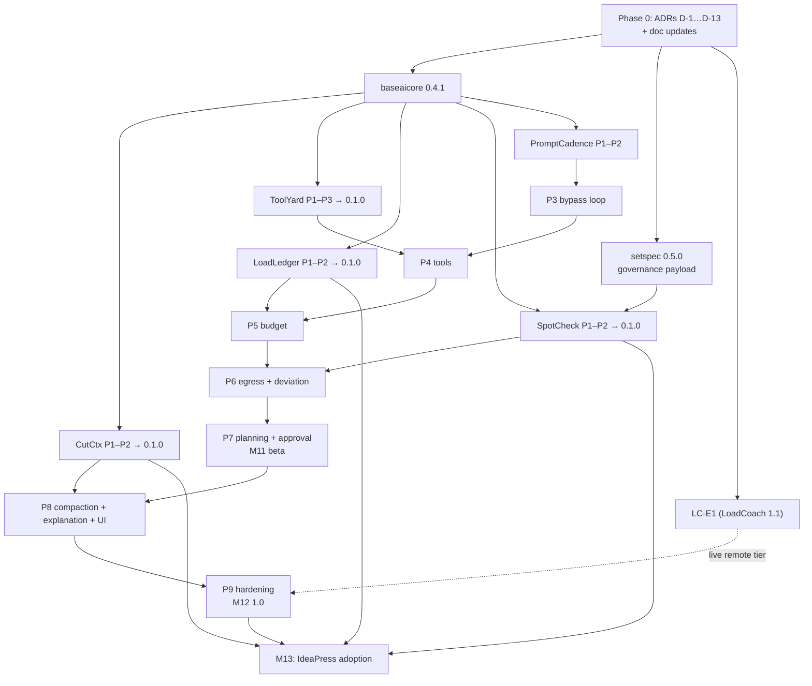

# PromptCadence Arc — Production Plan

**From:** the accepted design skeleton (`harness.md`, 2026-09-01) — a plan-approved, tier-routed
agent harness over LoadCoach, plus the shared capability packages it justifies.
**To:** one new application (`promptcadence 1.0.0`), four new published packages (`cutctx`,
`toolyard`, `loadledger`, `spotcheck`), two additive releases of existing packages
(`baseaicore 0.4.1`, `setspec 0.5.0`), one additive LoadCoach enhancement (LC-E1), and adoption of
three of the new packages by IdeaPress.
**Sequencing principle:** unchanged from the [master roadmap](master-roadmap.md) — dependency
order and rework risk, not calendar dates. Milestones continue the suite's numbering: **M10–M13**.
**Parallel stream:** the [Adapter arc](adapter-roadmap.md) (hot-swappable LoRA serving via
llama.cpp) shares this arc's Phase 0 — its contracts land jointly so every schema below is born
adapter-aware — and converges at M12; its sequencing rules are that roadmap's §5.
**Relationship to Suite 1.0:** this arc begins after M8 and **does not gate M9**. Suite 1.0 is
declared over the nine existing components exactly as the master roadmap defines it; the PromptCadence
arc is the suite's first post-1.0 expansion, and treating it as such keeps M9's checklist finite.

**Specifications:** [PromptCadence](../apps/promptcadence/spec.md) ([lifecycle](../apps/promptcadence/lifecycle.md),
[plan](../apps/promptcadence/development-plan.md)) ·
[CutCtx](../packages/cutctx/spec.md) · [ToolYard](../packages/toolyard/spec.md) ·
[LoadLedger](../packages/loadledger/spec.md) · [SpotCheck](../packages/spotcheck/spec.md)

---

## 1. What the skeleton left open, and where each answer now lives

The skeleton's §9 flagged seven open questions as "the intended surface area for the expansion
pass". Each is resolved:

| Skeleton question | Resolution | Where |
|---|---|---|
| `TierPolicy` taxonomy | Tiers are operator configuration over LoadCoach task profiles; four shipped defaults, invariants (remote ⇒ ceiling + pricing) enforced in code, taxonomy not fixed | [Spec §12](../apps/promptcadence/spec.md), [Lifecycle §3](../apps/promptcadence/lifecycle.md), D-3 |
| `PlanStep` cost estimation | Layered estimator with recorded source: historical p80 per (tier, profile) at ≥ 20 samples, else configured default; model guesses never an input | [Lifecycle §6](../apps/promptcadence/lifecycle.md), D-3 |
| DAG scheduling | Ready-set dispatch, serial by default; concurrency only across disjoint surfaces (≤ 1 local ever, per ADR-0038; bounded remote) | [Lifecycle §8](../apps/promptcadence/lifecycle.md) |
| Human-in-the-loop approval | A mode (`auto`/`hybrid`/`manual`) with a dedicated `approve` scope; gates fire in bypass mode too | [Lifecycle §4](../apps/promptcadence/lifecycle.md), D-5 |
| ThreadRack's second consumer | None exists ⇒ **not a package** (ADR-0011 rule 4); built PromptCadence-internal, package-shaped, extraction trigger recorded | [Spec §10](../apps/promptcadence/spec.md), D-1 |
| `Plan` schema versioning | Application-owned documents (ADR-0035): plan internal, explanation exported as `promptcadence.trajectory_explanation` 1.0; SetSpec only if another app ever reads a plan | [Spec §9](../apps/promptcadence/spec.md), D-7 |
| SpotCheck: package vs bare event type | Both, split correctly: the *shape* is SetSpec (`governance.egress_decision` 1.0), the comparison + ledger are a deliberately tiny package, application policy stays out | [SpotCheck spec](../packages/spotcheck/spec.md), D-10 |

Two further findings the expansion made that the skeleton did not contain:

* **Budgets need two ceilings.** ADR-0030 makes a local model's cost `UNSUPPORTED`, never $0 — so
  a money ceiling alone cannot govern local execution. Token ceilings bind everywhere; money
  ceilings bind priced usage; a remote tier without a pricing record is refused
  (`UNPRICED_EGRESS_REFUSED`). [Lifecycle §6](../apps/promptcadence/lifecycle.md).
* **"LoadCoach unchanged" is true for local tiers only.** LoadCoach 1.0 configures exactly one
  provider (`[provider] kind/base_url`); a mixed candidate pool — a second local runtime
  (llama.cpp, for the LoRA arc's hot-swappable adapters) or a remote endpoint — needs the
  additive multi-provider registration recorded as **LC-E1** (§5), since generalized from
  remote-only to any additional provider, local or remote. Until it lands, remote tiers refuse
  with a documented reason — specified behaviour, not a gap.

**Spec-review refinements (2026-09-01, after the expansion).** A review pass added two structural
decisions and two simplifications, folded into the specs and recorded as D-12 and D-13 below: the
**`ExecutionIntent`** — the immutable approved envelope minted by approval (in both paths) that
every turn is checked against, collapsing the plan-vs-default two-source deviation logic into one
pure comparison and closing the deviation taxonomy (one category per intent field); **materialized
explanation revisions** — the composed explanation cached at terminal transitions so a
retain-forever deployment's dominant read is one row + one artifact instead of a seven-table
reconstruction; an **explicit state machine** (states, transitions, guards, events and recovery
edges as normative tables, [Lifecycle §8](../apps/promptcadence/lifecycle.md)); and the removal of
the sub-millisecond egress-evaluation performance target — a pure in-memory comparison beside
multi-second model calls needs no budget of its own.

## 2. Decisions and the ADRs that must exist before code

Per the suite's rule — a missing architectural decision is a documentation defect, closed with an
ADR before code — Phase 0 of this arc writes the following. Numbers are assigned sequentially at
writing time (0045 onward if nothing lands first); the D-ids below are stable references for this
plan.

| ID | Decision (stated unambiguously) | Revisit when |
|---|---|---|
| **D-1** | PromptCadence is a fourth top-level application: HTTP-only suite interaction, requires LoadCoach for execution (not startup), imports neither ModelRack nor SweatMeter — a harness with direct provider access would own a second, ungoverned egress path. Records the ThreadRack rejection. | A PromptCadence deployment that must run with no LoadCoach at all; a second consumer of thread state appears |
| **D-2** | `baseaicore.DataClassification` — ordered, three levels (`PUBLIC < INTERNAL < CONFIDENTIAL`), caller-declared, defaulting to most restrictive. Ships additively as `baseaicore 0.4.1` (inside every existing `>=0.4,<0.5` pin). | A deployment needs finer levels — additions are a new ADR because ordering is the contract |
| **D-3** | Tiers are configuration over LoadCoach task profiles; PromptCadence does no routing math. A remote tier must declare `max_data_classification` and a pricing source. Step estimates are labelled by source; a model-generated number never sizes the budget that constrains the model. | Tier count/shape proves per-organization-variable beyond config; FreeWeight ships `native.plan` |
| **D-4** | The bypass removes planning and plan approval only — never tier resolution, budget, classification, egress or the audit trail. Enforced by the governance-invariance diff test (PromptCadence contract 1). | Never — this is the design's load-bearing wall; weakening it is a new design |
| **D-5** | Approval is a mode (`auto`/`hybrid`/`manual`) with a distinct `approve` token scope; hybrid gates fire in bypass mode per turn. Pending approvals expire and halt. Approval's output is the minting of `ExecutionIntent`s (D-12). | Multi-operator workflows need routing of approvals to people |
| **D-6** | A shared package may ship **mountable persistence models**: plain-typed SQLAlchemy tables the application mounts into its own metadata and Alembic history. The package never owns an engine, session, migration history or the data; it never imports WeightsDB (no sibling imports). | A third mountable package appears (extract the mounting test kit); a host migration story breaks |
| **D-7** | Plans are PromptCadence-internal; the trajectory explanation is an application-owned document (`promptcadence.trajectory_explanation` 1.0, ADR-0035 namespace); PromptCadence's events ride the existing SetSpec `EventEnvelope`. The one new SetSpec payload is `governance.egress_decision` 1.0, because IdeaPress's badge is a named second reader. | Another application needs to read a PromptCadence plan directly |
| **D-8** | Compaction is a view, never a deletion, and CutCtx is pure: policies *plan* summarization (`SummarizationRequest`); applications execute it through their own governed inference path. Summaries of confidential turns run on local tiers only. | An embeddings-based policy needs model access — it still arrives as a planned request |
| **D-9** | Tool execution discipline: registry-allowlisted handlers registered in code at startup; model-influenced failures are structured `ToolResult`s, never exceptions; command isolation reuses the ADR-0018 tier ladder (container → bwrap → **refuse**); `http_fetch` implements ADR-0026 §3 itself. | A platform sandbox tier is added; a consumer needs dynamic tool loading (expect **no** — that is the alternative this ADR rejects) |
| **D-10** | SpotCheck's scope is exactly: the payload, the ordered comparison (fail closed on an undeclared ceiling), and an append-only ledger. Enforcement and deployment policy are the caller's. | The package accretes an application concept — ADR-0011's boundary-violation rule applies |
| **D-11** | **LC-E1 (generalized)**: LoadCoach gains additive multi-provider registration — `[providers.<name>]` blocks, each naming a provider kind (`ollama`, `llamacpp`, `openai_compatible`) and a `remote` flag — with every provider's models entering the one registry tagged by provider and egress class; routing, `allow_remote` and the cost factor unchanged in meaning. Generalized 2026-09-01 from remote-only: the LoRA arc needs a second **local** runtime (llama.cpp, hot-swappable adapters) beside Ollama, so registration is provider-kind-agnostic rather than remote-specific. Owned by the LoadCoach repository as LoadCoach 1.1. | A provider appears that the ModelRack `Provider` protocol cannot express |
| **D-12** | Every turn executes under exactly one immutable, revisioned **`ExecutionIntent`** — the approved envelope (tier + fallbacks, tools, classification ceiling, step budget, max turns). Approval, in every mode, and the bypass default alike, is the act of minting one; scoped re-approval supersedes with a new revision, never an edit; deviations are category-typed per intent field, one category per field, closed by construction ([Lifecycle §4.3, §5](../apps/promptcadence/lifecycle.md)). | An intent needs a field no plan or policy supplies — that is a new governance dimension, not a schema tweak |
| **D-13** | The trajectory explanation is **materialized** as revisioned snapshots at terminal transitions; the rows remain the sole source of truth, every row-changing operation (retention scrub, re-costing, schema bump) bumps the revision, and `materialize(rows) == compose_live(rows)` is a tested equality ([Lifecycle §9.1](../apps/promptcadence/lifecycle.md)). Without it, "explain trajectory X" is a seven-table reconstruction re-paid on every read, growing with trajectory complexity — on a retain-forever deployment, the dominant query. | Materialization cost at terminal transitions becomes user-visible latency (move to incremental per-turn segments) |

## 3. Milestones

| # | Milestone | Content | Exit condition |
|---|---|---|---|
| **M10** | Harness foundations | Phase 0 (ADRs + doc updates) · `baseaicore 0.4.1` · `setspec 0.5.0` (Phase 6: `governance.egress_decision`, goldens) · CutCtx P1–P2 · ToolYard P1–P3 · LoadLedger P1–P2 · SpotCheck P1–P2 — all four at 0.1.0 on PyPI | Each package's standalone acceptance script runs in a clean venv with no suite application installed; a `setspec`-only reader validates an egress-decision golden |
| **M11** | PromptCadence beta | PromptCadence P1–P7 | On real LoadCoach + Ollama: one planned and one bypassed trajectory, tools + budget + egress active in both, records identical in shape minus plan rows; a confidential trajectory provably cannot reach a remote tier; `0.9.0b0` tagged at the demonstration |
| **M12** | PromptCadence 1.0 | PromptCadence P8–P9 · LC-E1 (LoadCoach 1.1) · CutCtx/ToolYard 0.2.0 | Every PromptCadence spec §20 criterion; one live remote-tier trajectory (public data, priced, budgeted, badged) or the explicit release-scope decision to ship with remote tiers refusing honestly; independent verification with permission to say *not ready*; `promptcadence 1.0.0` published |
| **M13** | Adoption — extraction complete | IdeaPress 1.1: LoadLedger (per-unit/project cost), SpotCheck (the S4 badge on real records), CutCtx (`project_review` context assembly) | IdeaPress shows what a unit cost and where its data went, from the shared packages; every new package has two real consumers — the ADR-0011 bar met in fact, not by intent |

## 4. Work streams, dependencies and parallelism

Two streams: **P — packages and contracts**, **S — PromptCadence**. Adoption (M13) is a third, strictly
after both.

| May run concurrently | Because |
|---|---|
| CutCtx, ToolYard, LoadLedger P1 | Only `baseaicore` in common; no shared surface |
| PromptCadence P1–P2 and all package phases | P1–P2 need only the foundation packages |
| SetSpec Phase 6 and every package but SpotCheck | Only SpotCheck consumes the payload |
| LC-E1 and PromptCadence P1–P8 | Different repositories; PromptCadence needs it only for P9's live remote run |

| May **not** overlap | Because |
|---|---|
| SpotCheck P1 and SetSpec Phase 6 | The payload must be published before its consumer pins it — the FreeWeight P11 / SetSpec freeze lesson |
| PromptCadence P4 and ToolYard P2–P3 | No tool executes in PromptCadence before the discipline it depends on is published — a security ordering, not a convenience |
| M13 and PromptCadence P9 | Adoption targets a released 1.0 surface; adopting a moving target repeats the extraction anti-pattern ADR-0011 §rules exist to prevent |

The single-maintainer reality from the master roadmap applies unchanged: "parallel" means
*unblocked*. The practical order is Phase 0 → the four packages round-robin to 0.1.0 (each is
small) → PromptCadence P1–P7 straight through → LC-E1 while beta soaks → P8–P9 → M13.

## 5. Changes to existing components — the complete list

| Component | Change | Nature |
|---|---|---|
| **BaseAiCore** | `DataClassification` (D-2) | Additive, `0.4.1`; lands inside every existing pin |
| **SetSpec** | Phase 6: `setspec.governance.v1`, `governance.egress_decision` 1.0, JSON Schema + ≥ 3 goldens; capability vocabulary untouched; frozen v1 payloads untouched | Additive, `0.5.0` |
| **LoadCoach** | **LC-E1** (D-11, generalized): `[providers.<name>]` registration, local or remote; discovery tags each model with its provider and egress class; everything downstream (constraints, `allow_remote`, cost factor, explanations) already speaks "remote" | Additive config + registry code, LoadCoach `1.1.0` — the only code change to a shipped application in this arc |
| **LoadCoach** | Five task profiles (`tools.plan`, `tools.agent.local_fast/local_large/remote_cheap/remote_frontier`) | Configuration shipped as documentation; no code |
| **FreeWeight** | Nothing required. `native.tool_use`/`native.agent` evidence already reaches tier profiles through the normal evidence pipeline. A `native.plan` category is a recorded future extension, not a dependency | None |
| **IdeaPress** | Nothing until M13 | Adoption only, `1.1.0` |
| **ModelRack, SweatMeter, WeightsDB, MirrorWall** | Nothing | Pure reuse |
| **docs/** | Phase 0 updates (§7) | Documentation |

## 6. M13 — adoption phases (IdeaPress 1.1)

Three independent phases, each optional, each with the same shape: adopt, delete the in-app
equivalent, prove behaviour unchanged plus the new capability.

1. **IP-A1 — LoadLedger.** Mount the tables; debit per attempt with `pricing_hash`; per-unit and
   per-project cost in the workspace UI (`—` for unpriced local runs, with the reason). Exit: a
   project page answers "what did this cost?" honestly, and ADR-0030's context sentence is
   finally shipped behaviour.
2. **IP-A2 — SpotCheck.** The S4 egress badge reads recorded decisions (backend = target);
   denials visible in the project history. Exit: the badge is backed by rows, not by an ad-hoc
   flag.
3. **IP-A3 — CutCtx.** `project_review` and stage-context assembly express the documented
   reduction order as a policy chain; the in-app reduction code is deleted. Exit: the stage's
   context assembly is golden-tested through the shared package with identical output on the
   fixture projects.

## 7. Phase 0 — documentation work (before any code)

* Write and accept ADRs D-1…D-13 with real alternatives; link from the ADR index.
* Jointly with the [Adapter arc](adapter-roadmap.md)'s LA0: ADRs A-1…A-10, the additive
  BaseAiCore/SetSpec adapter types, and optional adapter fields in every schema this arc creates
  (turns, intents' recorded subjects, `trajectory_explanation` 1.0, the fake LoadCoach) — born,
  not retrofitted.
* Master architecture: amend via the ADRs (the document is frozen; amendments follow the
  ADR-0038 precedent) — §1.1 component table (+ PromptCadence, port 8768; + four packages), §1.5 task
  profiles note, §2 dependency graph and rules (new packages under rule 3; the SpotCheck→SetSpec
  edge), §3 ownership rows, §8 deployment note for PromptCadence, §11 forbidden list (+ "a package
  owning an application's migration history", + "direct provider access from PromptCadence").
* [docs/README](../README.md) index: the new component rows and reading order.
* [Gold Standards §2](../standards/gold-standards.md): sections for PromptCadence and the four
  packages.
* [Traceability matrix](../architecture/traceability-matrix.md) and
  [risk register](../architecture/risk-register.md): the arc's requirements and the new top
  risks (below).
* Master roadmap §1/§9: a pointer row for M10–M13 delegating to this document.
* On repository creation, mirror each component's documents into its repo `docs/`,
  byte-identical, per the mirroring rule.
* Retire `harness.md` with a pointer here (it is the skeleton this arc expanded; keeping two
  versions of the design invites drift).

## 8. Version trajectory

| Component | M10 | M11 | M12 | M13 |
|---|---|---|---|---|
| BaseAiCore | **0.4.1** | 0.4.1 | 0.4.1 | 0.4.1 |
| SetSpec | **0.5.0** | 0.5.0 | 0.5.0 | 0.5.0 |
| CutCtx | **0.1.0** | 0.1.0 | **0.2.0** | 0.2.x |
| ToolYard | **0.1.0** | 0.1.0 | **0.2.0** | 0.2.x |
| LoadLedger | **0.1.0** | 0.1.0 | 0.1.x | 0.1.x |
| SpotCheck | **0.1.0** | 0.1.0 | 0.1.x | 0.1.x |
| LoadCoach | 1.0.x | 1.0.x | **1.1.0** (LC-E1) | 1.1.x |
| PromptCadence | — | **0.9.0b0** | **1.0.0** | 1.0.x |
| IdeaPress | 1.0.x | 1.0.x | 1.0.x | **1.1.0** |

New packages reach 1.0 only when two applications have exercised them — after M13, at the suite's
next collective 1.0 pass, matching the master roadmap's rule.

## 9. Integration verifications

None is complete on the basis of a code review.

| # | Integration | At | Verification |
|---|---|---|---|
| **I10** | PromptCadence ↔ LoadCoach | S-P3, re-run each phase | Contract tests against LoadCoach's committed OpenAPI snapshot; every configured tier's task profile exists in the running LoadCoach; the prompt LoadCoach forwards equals the prompt PromptCadence sent; one marked live journey |
| **I11** | Governance invariance | S-P7 | The contract-1 diff: planned vs bypassed records identical in shape minus plan/approval rows, on the same scripted task |
| **I12** | Egress contract | M10, re-run at M13 | A `setspec`-only script validates and reads a PromptCadence-exported `governance.egress_decision`; IdeaPress's badge later reads the same shape |
| **I13** | Mixed-pool routing (LC-E1) | S-P9 | With one local + one remote provider registered: a `remote_cheap`-tier step routes to the remote model with the egress badge and cost factor in LoadCoach's own explanation, and a local tier never does — recorded transport in CI, one live run |
| **I14** | Mounted persistence | LL-P2/SC-P2, then S-P5/P6 | Package tables autogenerate, migrate, and survive kill −9 inside a real host application's Alembic history on both dialects |

## 10. Top risks

| Risk | Impact | Mitigation |
|---|---|---|
| Local models draft unusable plans, making the planned path feel worse than bypass | High — the product's thesis | Corrective-retry budget; `tools.plan` constraints; a simpler linear plan shape as fallback; measured honestly in beta; `native.plan` benchmark as the long-term fix |
| Prompt injection through tool results steers the loop | High | D-9 discipline: allowlist + schema + containment + egress checks are all model-independent; the P9 injection corpus is a release gate |
| LC-E1 slips | Medium | 1.0 may ship with remote tiers refusing honestly — specified, documented behaviour; the release-scope decision is recorded at M12, not improvised |
| The mountable-models pattern (D-6) fights a host's Alembic setup | Medium | The miniature-host test in each package; PromptCadence as first real host before any 1.0 promise; the pattern is confined to two tiny packages |
| Governance overhead makes the harness slower than a raw loop by more than its worth | Medium | Spec §15 budgets bound PromptCadence's own overhead (≤ 25 ms/turn); the expensive part — planning — is exactly what the bypass removes, by design |
| Package sprawl: four new repos' maintenance | Medium | Each package is deliberately small with a named second consumer; ThreadRack was folded in precisely to hold this line |
